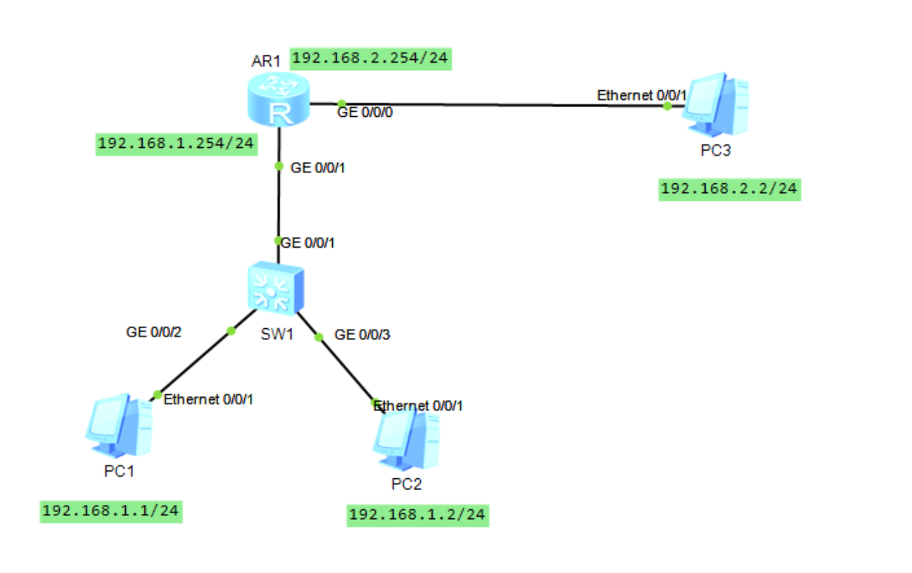
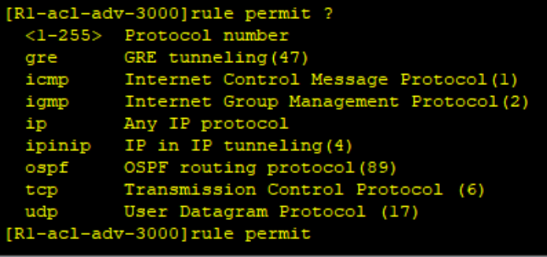

# ACL访问控制列表

## 网络拓扑图



## 添加acl

允许192.168.1.1

禁止192.168.1.2

在0/0/1接口进入时匹配acl 2000

```shell
R1
sys
undo in en
sysname R1
acl 2000
rule deny source 192.168.1.2 0.0.0.0
rule permit source 192.168.1.1 0.0.0.0
int g0/0/1
traffic-filter inbound acl 2000
```

此时PC1可以访问PC3，而PC2无法访问

```shell
traffic-filter inbound acl
```

至于这一条，设定接口在进的时候进行acl处理还是出的时候acl处理

通常设置在进的时候，即inbound，把不需要的流量拦截在接口之外，进入路由器再拦截会消耗cpu资源

## 高级ACL

高级acl编号在3000~3999，可以更精确的拦截

