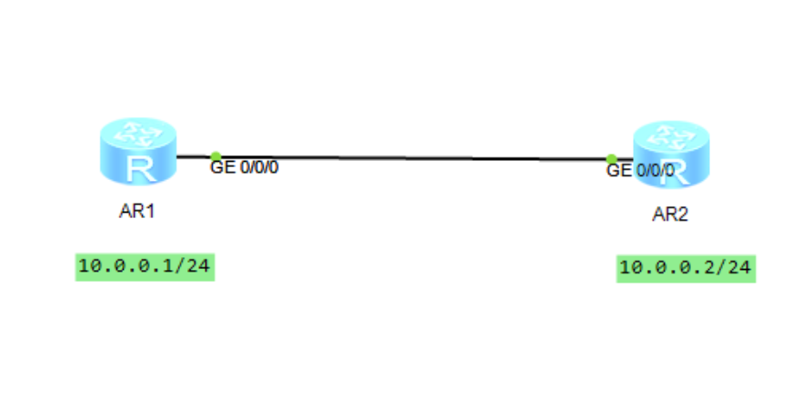
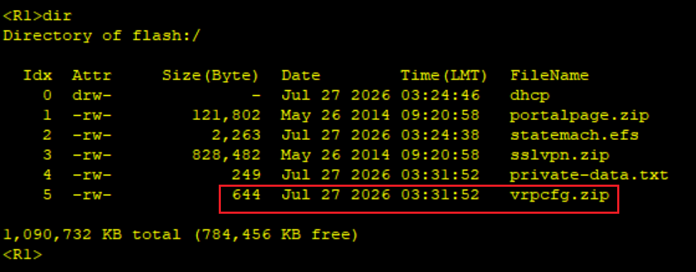
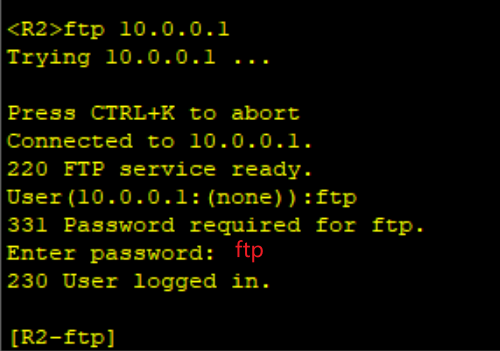
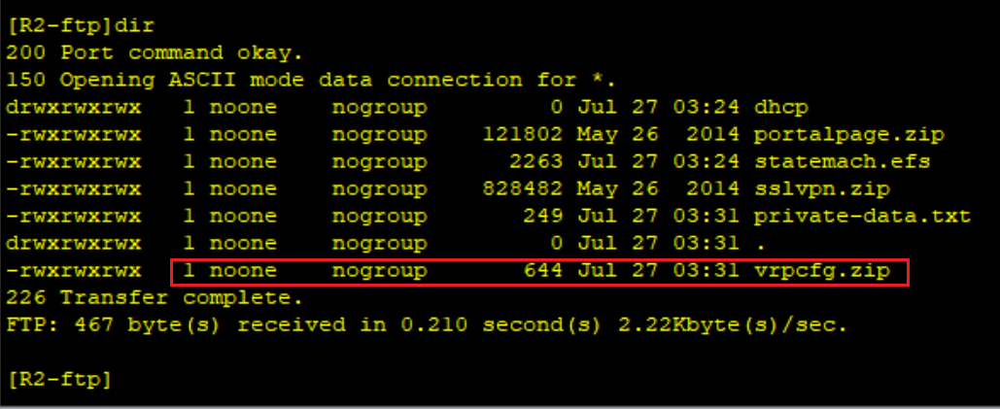
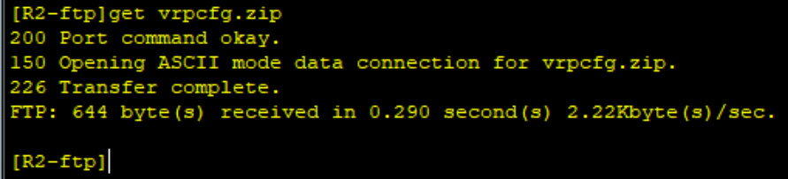
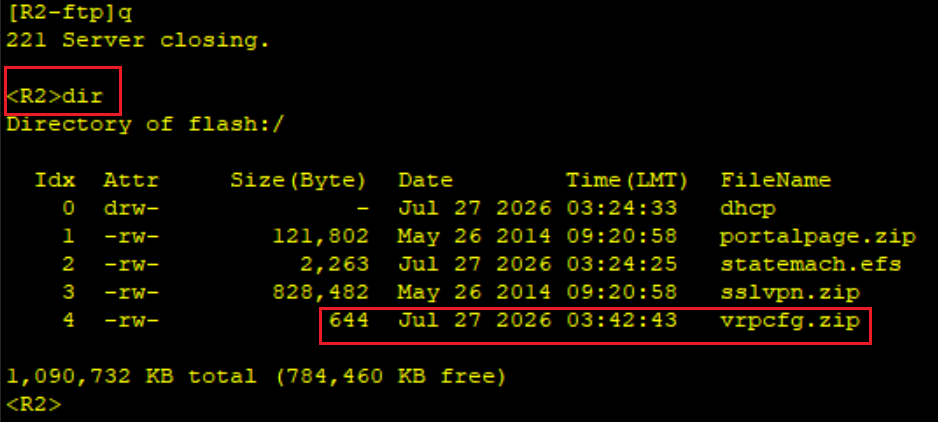

# FTP

## 网络拓扑图



先给两台设备配ip

R1开启ftp服务，配置aaa用户

账号ftp，密码ftp

ftp用户服务类型ftp

用户等级3

保存至flash

保存配置文件

```shell
R1
sys
undo in en
sys R1	
[R1]ftp server enable
[R1]aaa
[R1-aaa]local-user ftp password cipher ftp
[R1-aaa]local-user ftp service-type ftp
[R1-aaa]local-user ftp privilege level 3
[R1-aaa]local-user ftp ftp-directory flash:
return
save
y
```

保存位置在：



然后在R2访问R1的ftp

```shell
R2
sys
undo in en
sys R2
int g0/0/0
ip add 10.0.0.2 24
q
ftp 10.0.0.1
用户名：ftp
密码ftp
```



现在进入了R1的目录：



可以下载刚才的文件了

```shell
get vrpcfg.zip
```



退出ftp，可见文件已下载到R2

