# ipv6

## 网络拓扑图

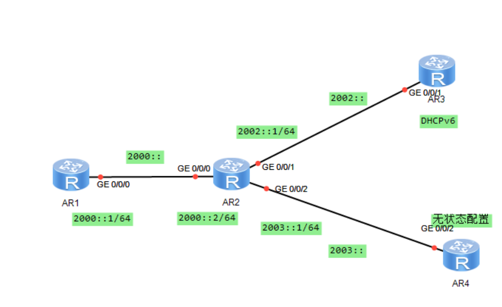

## 开启ipv6

路由器和接口都要开

```shell
R1
<Huawei>sys
[Huawei]undo in en
[Huawei]sys R1
[R1]ipv6
[R1]int g0/0/0
[R1-GigabitEthernet0/0/0]ipv6 en
```

```shell
R2
<Huawei>sys
[Huawei]undo in en
[Huawei]sys R2
[R2]ipv6
[R2]int g0/0/0
[R2-GigabitEthernet0/0/0]ipv6 en
```

## 配置地址

配置一个全球单播 2000::/3

```shell
R1
[R1-GigabitEthernet0/0/0]ipv6 add 2000::1 64
```

此时通过 display ipv6 interface 可以查看接口的ipv6情况：

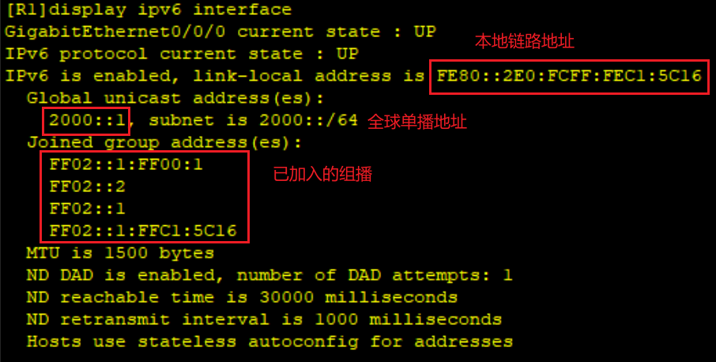

```shell
R2
[R2-GigabitEthernet0/0/0]ipv6 add 2000::2 64
```

然后 ping ipv6 2000::1 测试：
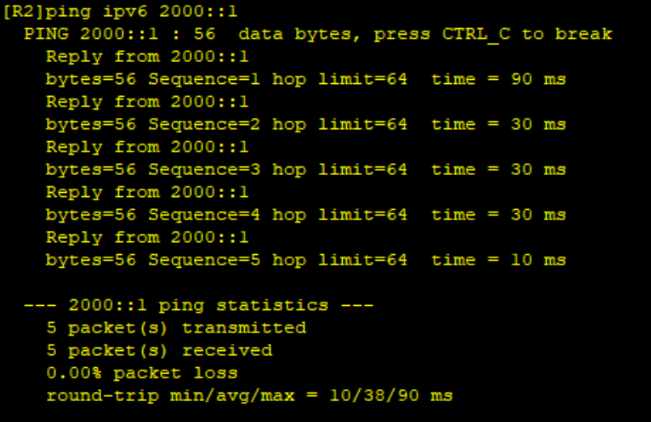

查看邻居表：

```shell
display ipv6 neighbors
```


全球单播地址取前三位：2000::/3

2000::	>>	0010 0000 0000 0000 ::

取前三位001就行

所以方便一点可以划分子网2001::  2002::  ...

配置R2的其他接口

```shell
[R2]int g0/0/1
[R2-GigabitEthernet0/0/1]ipv6 en
[R2-GigabitEthernet0/0/1]ipv6 add 2002::1 64
[R2-GigabitEthernet0/0/1]int g0/0/2
[R2-GigabitEthernet0/0/2]ipv6 en
[R2-GigabitEthernet0/0/2]ipv6 add 2003::1 64
```

## DHCPv6配置

在R2上开启dhcp

创建地址池

绑定网络

排除已存在的一个地址

指定dhcp服务分配接口

```shell
[R2]dhcp enable 
[R2]dhcpv6 pool dhcp1
[R2-dhcpv6-pool-dhcp1]address prefix 2002::/64
[R2-dhcpv6-pool-dhcp1]excluded-address 2002::1
[R2-dhcpv6-pool-dhcp1]int g0/0/1
[R2-GigabitEthernet0/0/1]dhcpv6 server dhcp1
```

在R3上开启dhcpv6获取

注意先配置链路本地地址

```shell
sys
undo in en
ipv6
dhcp en
int g0/0/1
ipv6 en
[R3-GigabitEthernet0/0/1]ipv6 address auto link-local 
[R3-GigabitEthernet0/0/1]ipv6 address auto dhcp
```

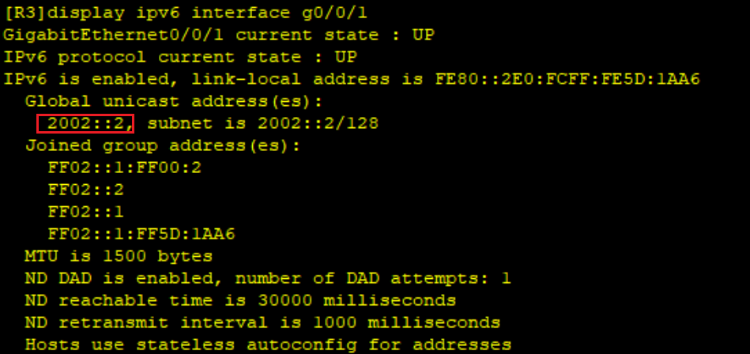

可见已经获得ipv6地址2002::2

## 无状态获取地址

R2开启RA报文发送

```shell
int g0/0/2
[R2-GigabitEthernet0/0/2] undo ipv6 nd ra halt
```

R1开启自动获取全局ipv6

```shell
<Huawei>sys
[Huawei]undo in en
[Huawei]sys R4
[R4]ipv6
[R4]int g0/0/2
[R4-GigabitEthernet0/0/2]ipv6 en	
[R4-GigabitEthernet0/0/2]ipv6 address auto global 
```

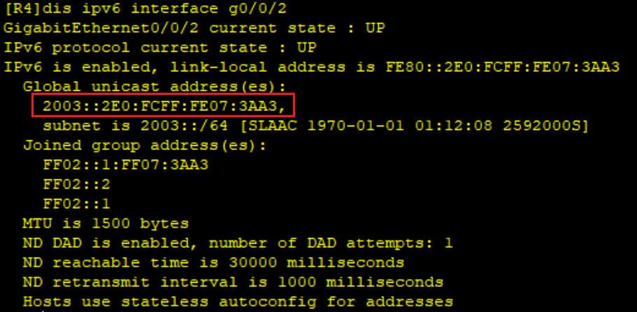

可见R4也获取到了地址

## 配置路由

R4配置静态路由

```shell
[R4]ipv6 route-static 2000:: 64 2003::1
[R4]ipv6 route-static 2002:: 64 2003::1
```

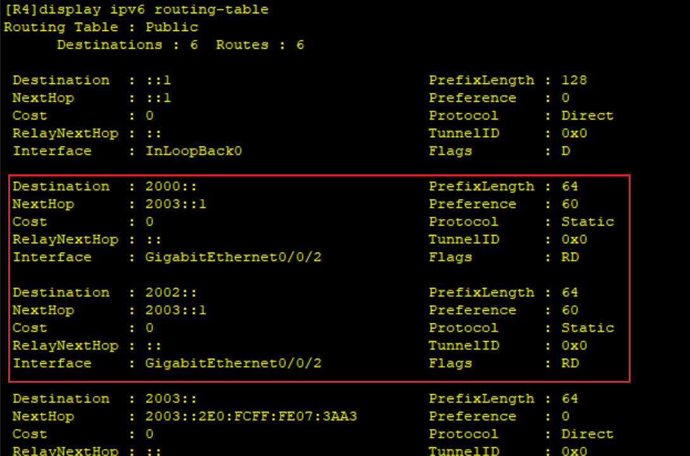

R1配置聚合后的静态路由

2002网段	>>	0010 0000 0000 001	0

2003网段	>>	0010 0000 0000 001	1

​								   ^ 第15位

```shell
[R1]ipv6 route-static 2002:: 15 2000::2
```

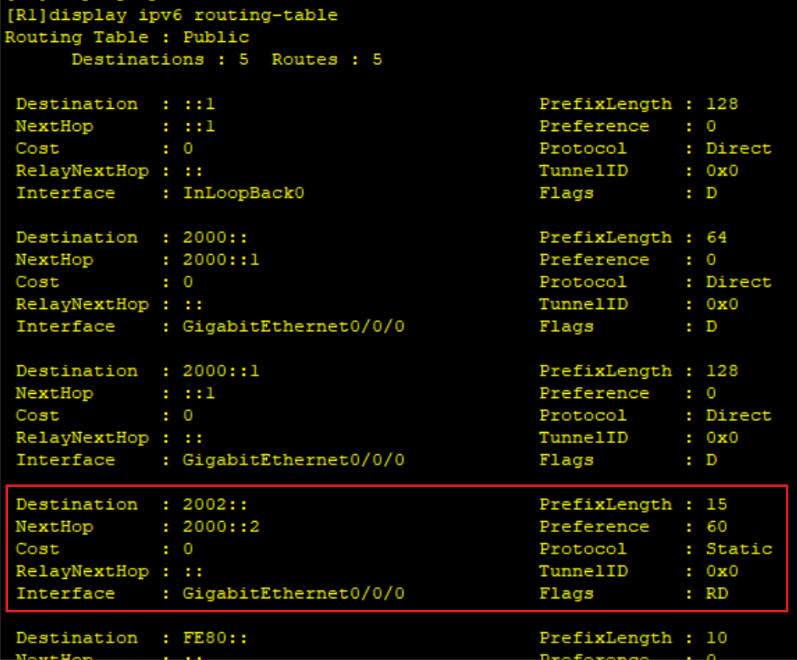

R3配置默认路由

接口是自己的，地址填对端接口链路本地地址

```shell
[R3]ipv6 route-static :: 0 g0/0/1 FE80::2E0:FCFF:FE8C:4B1E
```

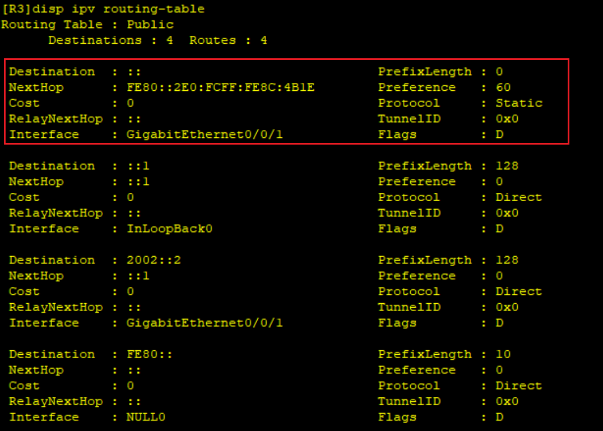

## ping测试

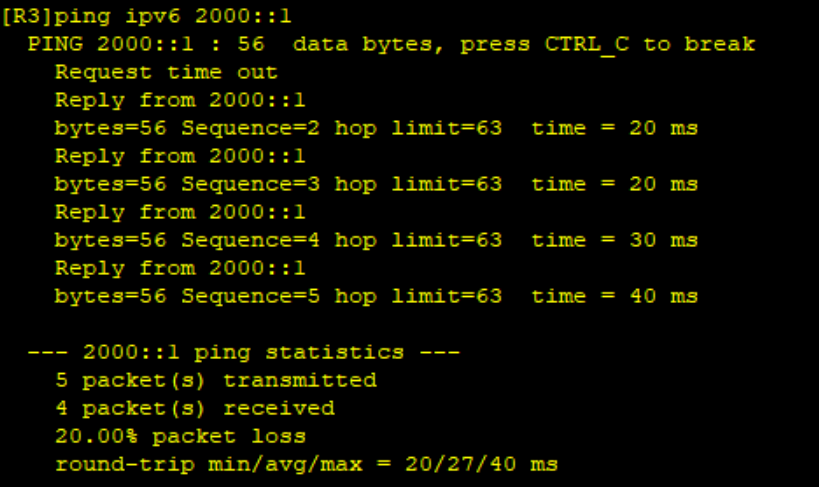

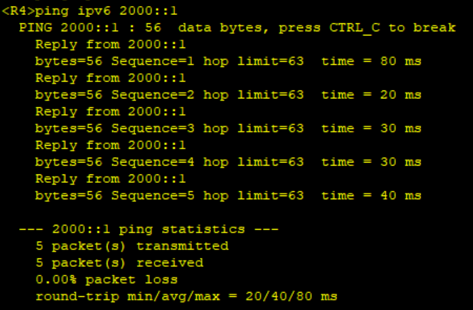

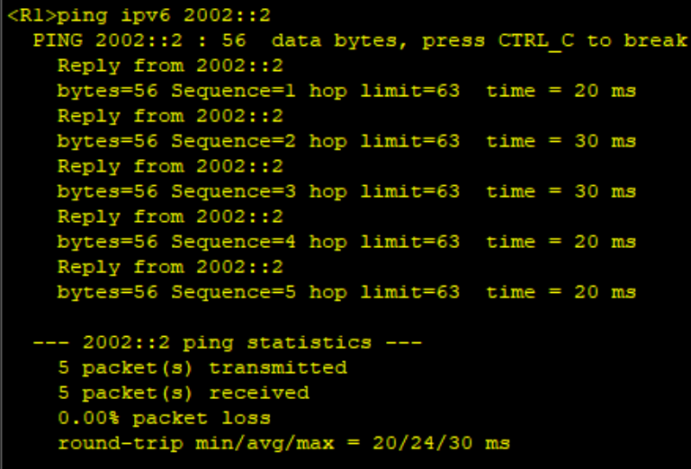

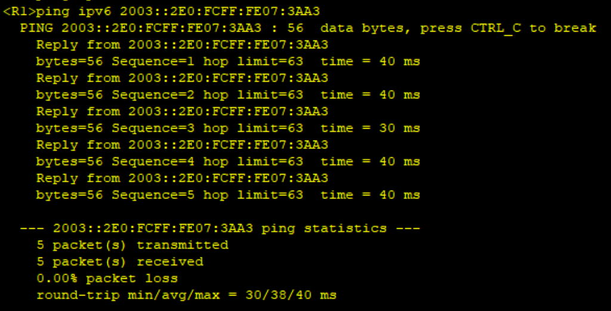