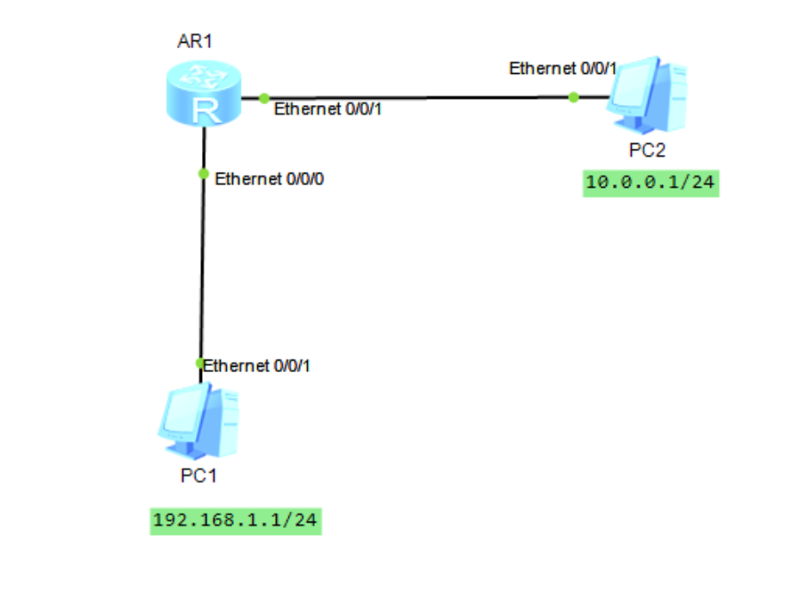
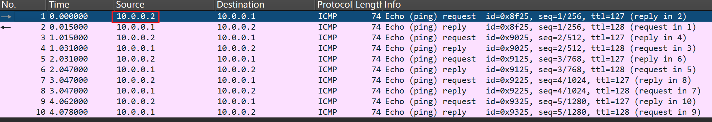
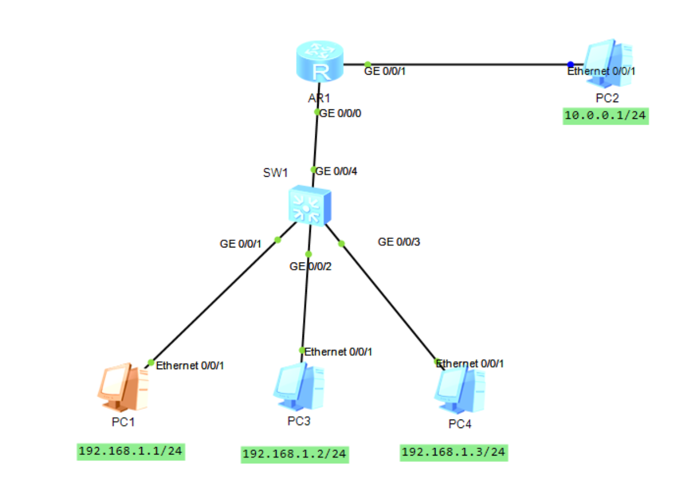
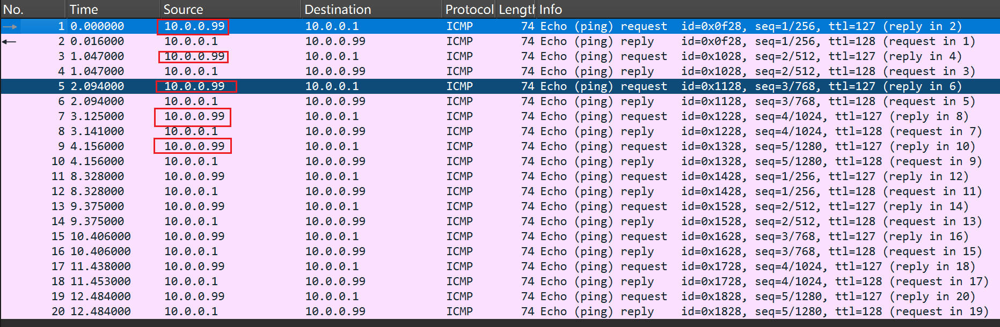
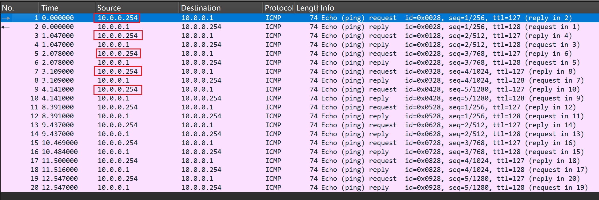
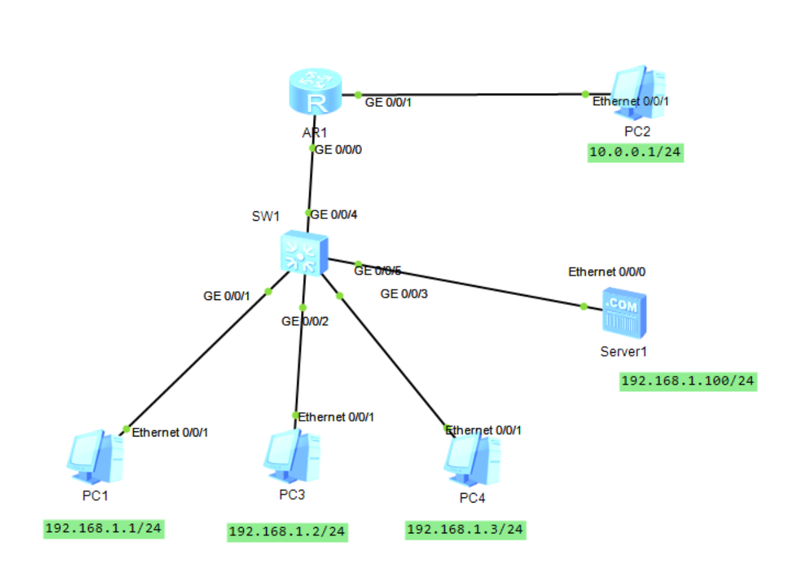

# NAT

## 网络拓扑图



网关254

## 静态NAT

先配置nat映射

```shell
[R1]nat static global 10.0.0.2 inside 192.168.1.1
```

再绑定出口接口

```shell
[R1-GigabitEthernet0/0/1]nat static enable
```

对PC2接口进行抓包可见来自源ip：10.0.0.2的icmp包



而在PC1接口抓包可见源ip为：192.168.1.1


## 动态NAT

撤销静态nat

```shell
[R1]undo nat static global 10.0.0.2 inside 192.168.1.1
int g0/0/1
[R1-GigabitEthernet0/0/1]undo nat static enable
```

创建地址池

```shell
[R1]nat address-group 1 10.0.0.10 10.0.0.100
```

还要配置acl

借助acl来对网段内的地址进行批量转换

在出口处绑定地址池

```shell
[R1]acl 2000
[R1-acl-basic-2000]rule 5 permit source 192.168.1.0 0.0.0.255
[R1]int g0/0/1
[R1-GigabitEthernet0/0/1]nat outbound 2000 address-group 1 
```

此时转换的地址在 10.0.0.10 ~ 10.0.0.100 区间内


## NAPT

再加两台PC，用交换机连接



napt的配置和动态nat差不多，少了个no-pat而已

先撤销动态nat和地址池

地址池里只放一个地址 10.0.0.99

acl不用改

出口acl绑定只有一个地址

```shell
undo nat outbound 2000 address-group 1 no-pat 
undo nat address-group 1
[R1]nat address-group 1 10.0.0.99 10.0.0.99
[R1-GigabitEthernet0/0/1]nat outbound 2000 address-group 1
```

重新查看抓包发现都是同一个地址



### easy-ip

这是一种更简便的方法

连地址池都不要了，直接用出口接口的公网ip

先撤销之前的地址池

然后在出口直接 nat outbound 2000

```
int g0/0/1
undo nat outbound 2000 address-group 1
q
undo nat address-group 1
int g0/0/1
nat outbound 2000
```



可见多台PC直接用路由器出口公网ip访问PC2

## NAT Server



加一台内网服务器

直接在路由器出口接口上配置

```shell
nat server protocol tcp global current-interface 80 inside 192.168.1.100 80
```

有了这个后，相对于把192.168.1.100:80和10.0.0.254:80关联

公网设备只需要用指导私网路由器入口ip再通过80端口映射可以访问服务器内容

ensp不便演示，暂时到此为止

