# 网络综合

## 主机互通

现在有两台主机，位于部门1

PC1：

ip: 192.168.1.1/24	mac: 5489-98C3-6E9F

PC2:

ip: 192.168.1.2/24	mac: 5489-98D4-14A1

给他们配一个同网段的ip地址，使用S3700交换机互联，PC1和PC2之间可以二层通信

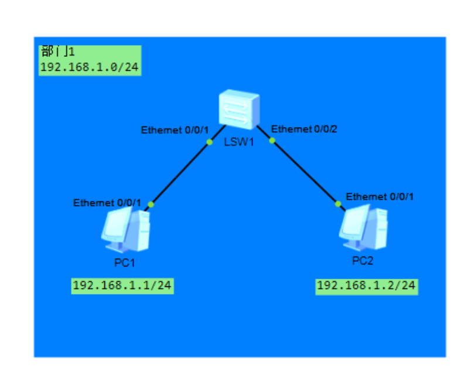

现在进行ping测试：

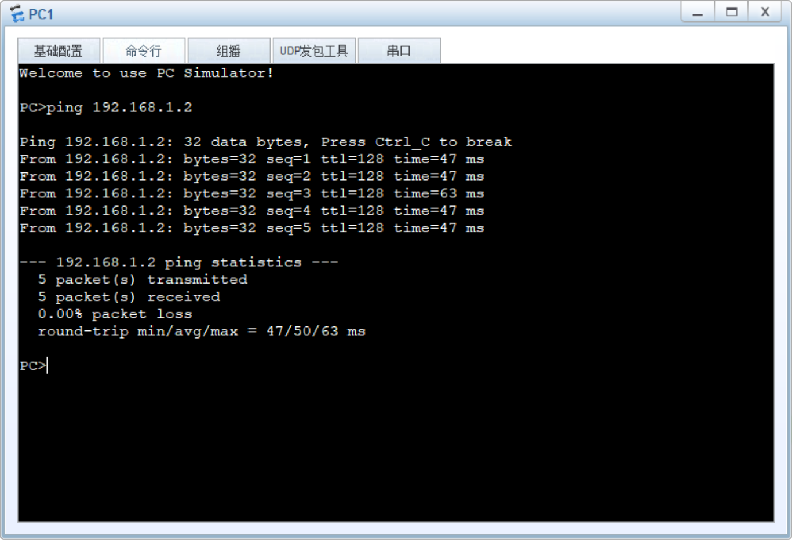

PC1和PC2可以通信

## 部门互通

现在，另一个部门2，也有两台主机

PC3: ip: 192.168.2.1    mac: 5489-98F0-5FBC

PC4: ip: 192.168.2.2    mac: 5489-980A-2E4D

也使用S3700交换机互联

将两个交换机相连

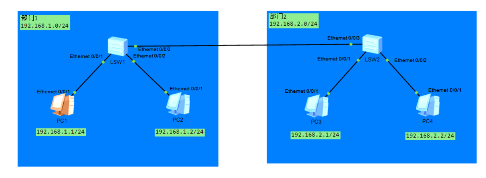

现在尝试两个部门间的PC互通

PC1开始pingPC3

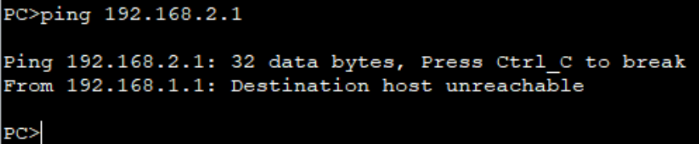

发现 “Destination host unreachable”，“目标主机不可达”

因为PC1和PC3不在同一网段中

PC1位于网段192.168.1.0/24

PC3位于网段192.168.2.0/24

### 划分vlan

这时候就需要三层功能了

现在加一台三层交换机SW3(S5700)，SW2和SW1断开，现在都连接到SW3上

划分两个vlan

192.168.1.0/24	vlan10

192.168.2.0/24	vlan20

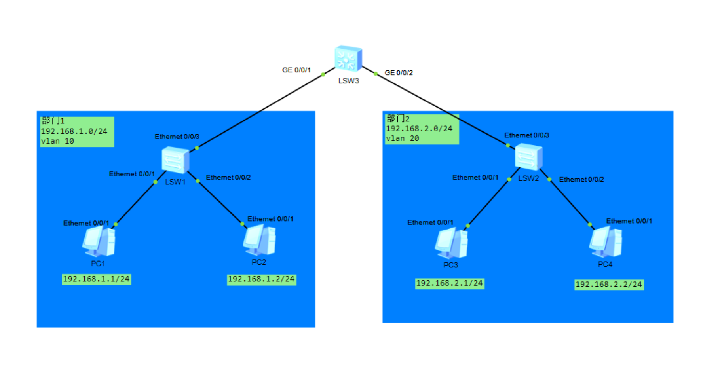

### 配置vlan及接口

创建vlan，分配access和trunk接口

access分配于和主机相连的接口，不携带vlan tag转发

trunk分配于交换机之间的接口，携带vlan tag转发

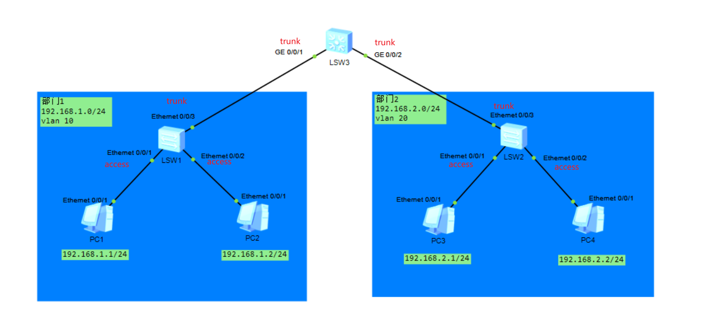

```
SW1
<Huawei>system-view
[Huawei]sysname SW1
[SW1]undo info-center enable
[SW1]vlan 10
[SW1-vlan10]quit
[SW1]interface Ethernet0/0/1
[SW1-Ethernet0/0/1]port link-type access
[SW1-Ethernet0/0/1]port default vlan 10
[SW1-Ethernet0/0/1]interface Ethernet0/0/2
[SW1-Ethernet0/0/2]port link-type access
[SW1-Ethernet0/0/2]port default vlan 10
[SW1-Ethernet0/0/2]interface Ethernet0/0/3
[SW1-Ethernet0/0/3]port link-type trunk
[SW1-Ethernet0/0/3]port trunk allow-pass vlan 10
```

```
SW2
<Huawei>system-view
[Huawei]sysname SW2
[SW2]undo info-center enable
[SW2]vlan 20
[SW2-vlan20]quit
[SW2]interface Ethernet0/0/1
[SW2-Ethernet0/0/1]port link-type access
[SW2-Ethernet0/0/1]port default vlan 20
[SW2-Ethernet0/0/1]interface Ethernet0/0/2
[SW2-Ethernet0/0/2]port link-type access
[SW2-Ethernet0/0/2]port default vlan 20
[SW2-Ethernet0/0/2]interface Ethernet0/0/3
[SW2-Ethernet0/0/3]port link-type trunk
[SW2-Ethernet0/0/3]port trunk allow-pass vlan 20
```

```
SW3
<Huawei>system-view
[Huawei]sysname SW3
[SW3]undo info-center enable
[SW3]vlan batch 10 20
[SW3]interface GigabitEthernet0/0/1
[SW3-GigabitEthernet0/0/1]port link-type trunk
[SW3-GigabitEthernet0/0/1]port trunk allow-pass vlan 10
[SW3-GigabitEthernet0/0/1]interface GigabitEthernet0/0/2
[SW3-GigabitEthernet0/0/2]port link-type trunk
[SW3-GigabitEthernet0/0/2]port trunk allow-pass vlan 20
```

vlan已经创建划分完成了，但部门还是无法互通，因为还没有三层功能

### 配置vlanif

现在在SW3配置vlanif

再在各个主机指定所在网络网关

PC1，PC2网关: 192.168.1.254

PC3，PC4网关: 192.168.2.254

这些vlanif接口上配置的就是网关地址

```
SW3
[SW3]interface Vlanif 10
[SW3-Vlanif10]ip address 192.168.1.254 24
[SW3-Vlanif10]interface Vlanif 20
[SW3-Vlanif20]ip address 192.168.2.254 24
```

现在部门间就可以ping通了

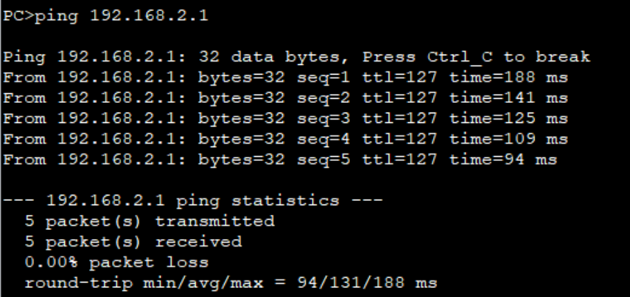

## 设备冗余/负载均衡

如果SW3出现故障，那么两个部门间的通信会马上断掉，因此需要做设备冗余

现在再加一个汇聚交换机SW4

SW1和SW2再和SW4相连，华为默认开启mstp所以不用担心成环路

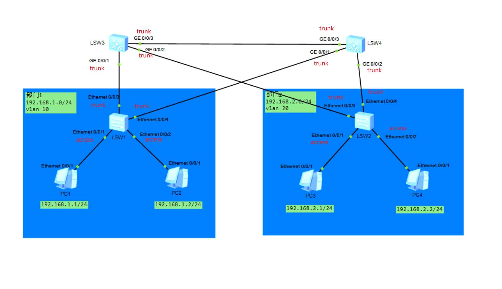

补上相关接口

```
SW1
[SW1]interface Ethernet0/0/4
[SW1-Ethernet0/0/4]port link-type trunk
[SW1-Ethernet0/0/4]port trunk allow-pass vlan 10
```

```
SW2
[SW2]interface Ethernet0/0/4
[SW2-Ethernet0/0/4]port link-type trunk
[SW2-Ethernet0/0/4]port trunk allow-pass vlan 20
```

```
SW3
[SW3]interface GigabitEthernet0/0/3
[SW3-GigabitEthernet0/0/3]port link-type trunk
[SW3-GigabitEthernet0/0/3]port trunk allow-pass vlan 10 20
```

```
SW4
<Huawei>system-view
[Huawei]undo info-center enable
[Huawei]sysname SW4
[SW4]vlan batch 10 20
[SW4]interface GigabitEthernet0/0/1
[SW4-GigabitEthernet0/0/1]port link-type trunk
[SW4-GigabitEthernet0/0/1]port trunk allow-pass vlan 10
[SW4-GigabitEthernet0/0/1]interface GigabitEthernet0/0/2
[SW4-GigabitEthernet0/0/2]port link-type trunk
[SW4-GigabitEthernet0/0/2]port trunk allow-pass vlan 20
[SW4-GigabitEthernet0/0/2]interface GigabitEthernet0/0/3
[SW4-GigabitEthernet0/0/3]port link-type trunk
[SW4-GigabitEthernet0/0/3]port trunk allow-pass vlan 10 20
```

配置优先级

SW3主发vlan10，次发vlan20

SW4主发vlan20，次发vlan10

```
SW3
[SW3]interface Vlanif 10
[SW3-Vlanif10]ip address 192.168.1.253 24
[SW3-Vlanif10]vrrp vrid 1 virtual-ip 192.168.1.254
[SW3-Vlanif10]vrrp vrid 1 priority 120
[SW3-Vlanif10]interface Vlanif 20
[SW3-Vlanif20]ip address 192.168.2.252 24
[SW3-Vlanif20]vrrp vrid 2 virtual-ip 192.168.2.254
```

```
SW4
[SW4]interface Vlanif 10
[SW4-Vlanif10]ip address 192.168.1.252 24
[SW4-Vlanif10]vrrp vrid 1 virtual-ip 192.168.1.254
[SW4-Vlanif10]interface Vlanif 20
[SW4-Vlanif20]ip address 192.168.2.253 24
[SW4-Vlanif20]vrrp vrid 2 virtual-ip 192.168.2.254
[SW4-Vlanif20]vrrp vrid 2 priority 120
```

### MSTP

华为ensp已经默认启用mstp多生成树

### mstp区域配置

现在只需要进行mstp区域配置

```
SW1
[SW1]stp region-configuration
[SW1-mst-region]region-name TEST
[SW1-mst-region]revision-level 1
[SW1-mst-region]instance 1 vlan 10
[SW1-mst-region]instance 2 vlan 20
[SW1-mst-region]active region-configuration
```

```
SW2
[SW2]stp region-configuration
[SW2-mst-region]region-name TEST
[SW2-mst-region]revision-level 1
[SW2-mst-region]instance 1 vlan 10
[SW2-mst-region]instance 2 vlan 20
[SW2-mst-region]active region-configuration
```

```
SW3
[SW3]stp region-configuration
[SW3-mst-region]region-name TEST
[SW3-mst-region]revision-level 1
[SW3-mst-region]instance 1 vlan 10
[SW3-mst-region]instance 2 vlan 20
[SW3-mst-region]active region-configuration
```

```
SW4
[SW4]stp region-configuration
[SW4-mst-region]region-name TEST
[SW4-mst-region]revision-level 1
[SW4-mst-region]instance 1 vlan 10
[SW4-mst-region]instance 2 vlan 20
[SW4-mst-region]active region-configuration
```

### 根桥设置

```
SW3
[SW3]stp instance 1 root primary
[SW3]stp instance 2 root secondary
```

```
SW4
[SW4]stp instance 2 root primary
[SW4]stp instance 1 root secondary
```

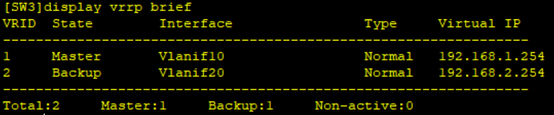

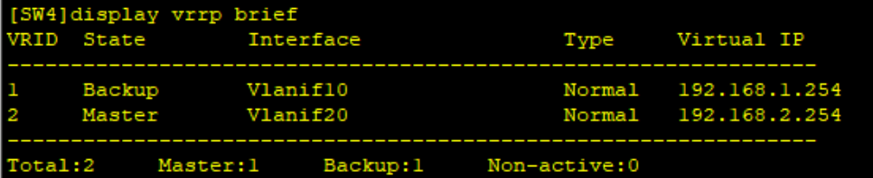

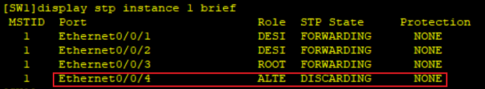

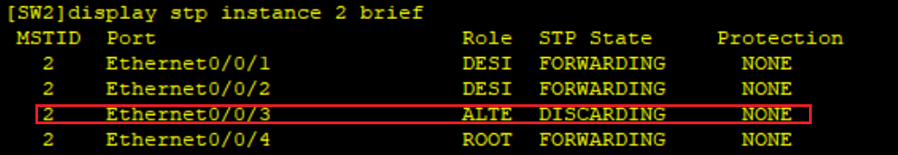

### 故障测试

现在断开SW1和SW3

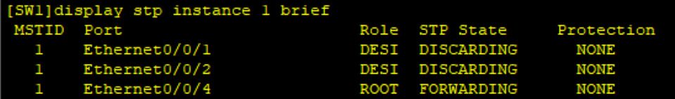

此时e0/0/1和e0/0/2处于阻塞状态，其实还没收敛完，等待大概30s

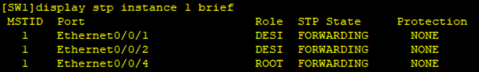

可见接口已经全部启用

PC1又可以ping通部门2了

## 链路聚合

接入交换机的上行链路再加一根线

目前交换机连线：
SW1与SW3: e3->g1, e4->g4
SW1与SW4: e5->g4, e6->g1
SW2与SW3: e3->g2, e5->g5
SW2与SW4: e4->g2, e6->g5

### 创建聚合组

创建聚合组

聚合接口组设置为trunk类型

聚合组放行valn

将聚合口加入聚合组，此前如果有vlan和trunk配置，则需要清除之前的配置并开启端口

```
SW1
[SW1]interface Eth-Trunk 1
[SW1-Eth-Trunk1]port link-type trunk
[SW1-Eth-Trunk1]port trunk allow-pass vlan 10
[SW1]interface Ethernet0/0/3
[SW1-Ethernet0/0/3]clear configuration interface Ethernet0/0/3
[SW1]interface Ethernet0/0/3
[SW1-Ethernet0/0/3]undo shutdown 
[SW1-Ethernet0/0/3]eth-trunk 1
[SW1-Ethernet0/0/3]interface Ethernet0/0/4
[SW1-Ethernet0/0/4]clear configuration interface Ethernet0/0/4
[SW1]interface Ethernet0/0/4
[SW1-Ethernet0/0/4]undo shutdown 
[SW1-Ethernet0/0/4]eth-trunk 1

[SW1]interface Eth-Trunk 2
[SW1-Eth-Trunk2]port link-type trunk 
[SW1-Eth-Trunk2]port trunk allow-pass vlan 10
[SW1-Eth-Trunk2]interface Ethernet0/0/5
[SW1-Ethernet0/0/5]eth-trunk 2
[SW1-Ethernet0/0/5]interface Ethernet0/0/6
[SW1-Ethernet0/0/6]eth-trunk 2
```

```
SW3
[SW3]interface Eth-Trunk 1
[SW3-Eth-Trunk1]port link-type trunk
[SW3-Eth-Trunk1]port trunk allow-pass vlan 10
[SW3-Eth-Trunk1]interface GigabitEthernet0/0/1
[SW3-GigabitEthernet0/0/1]clear configuration interface GigabitEthernet0/0/1
[SW3]interface GigabitEthernet0/0/1
[SW3-GigabitEthernet0/0/1]undo shutdown 
[SW3-GigabitEthernet0/0/1]eth-trunk 1
[SW3-GigabitEthernet0/0/4]interface GigabitEthernet0/0/4
[SW3-GigabitEthernet0/0/4]eth-trunk 1

[SW3]interface Eth-Trunk 2
[SW3-Eth-Trunk2]port link-type trunk
[SW3-Eth-Trunk2]port trunk allow-pass vlan 20
[SW3-Eth-Trunk2]interface GigabitEthernet0/0/2
[SW3-GigabitEthernet0/0/2]clear configuration interface GigabitEthernet0/0/2
[SW3]interface GigabitEthernet0/0/2
[SW3-GigabitEthernet0/0/2]undo shutdown
[SW3-GigabitEthernet0/0/2]eth-trunk 2
[SW3-GigabitEthernet0/0/2]interface GigabitEthernet0/0/5
[SW3-GigabitEthernet0/0/5]eth-trunk 2
```

```
SW2
[SW2]interface eth-trunk 1
[SW2-Eth-Trunk1]port link-type trunk
[SW2-Eth-Trunk1]port trunk allow-pass vlan 20
[SW2-Eth-Trunk1]quit
[SW2]interface Ethernet0/0/3
[SW2-Ethernet0/0/3]undo port trunk allow-pass vlan 20
[SW2-Ethernet0/0/3]undo port link-type 
[SW2-Ethernet0/0/3]eth-trunk 1
[SW2-Ethernet0/0/3]interface Ethernet0/0/5
[SW2-Ethernet0/0/5]eth-trunk 1

[SW2]interface Eth-Trunk 2
[SW2-Eth-Trunk2]port link-type trunk
[SW2-Eth-Trunk2]port trunk allow-pass vlan 20
[SW2-Eth-Trunk2]interface Ethernet0/0/4
[SW2-Ethernet0/0/4]undo port trunk allow-pass vlan 20
[SW2-Ethernet0/0/4]undo port link-type
[SW2-Ethernet0/0/4]eth-trunk 2
[SW2-Ethernet0/0/4]interface Ethernet0/0/6
[SW2-Ethernet0/0/6]eth-trunk 2
```

```
SW2
[SW4]interface Eth-Trunk 1
[SW4-Eth-Trunk1]port link-type trunk
[SW4-Eth-Trunk1]port trunk allow-pass vlan 10
[SW4-Eth-Trunk1]interface GigabitEthernet0/0/1
[SW4-GigabitEthernet0/0/1]undo port trunk allow-pass vlan 10
[SW4-GigabitEthernet0/0/1]undo port link-type
[SW4-GigabitEthernet0/0/1]eth-trunk 1
[SW4-GigabitEthernet0/0/1]interface GigabitEthernet0/0/4
[SW4-GigabitEthernet0/0/4]eth-trunk 1

[SW4]interface Eth-Trunk 2
[SW4-Eth-Trunk2]port link-type trunk
[SW4-Eth-Trunk2]port trunk allow-pass vlan 20
[SW4]interface GigabitEthernet0/0/2
[SW4-GigabitEthernet0/0/2]undo port trunk allow-pass vlan 20
[SW4-GigabitEthernet0/0/2]undo port link-type
[SW4-GigabitEthernet0/0/2]eth-trunk 2
[SW4-GigabitEthernet0/0/2]interface GigabitEthernet0/0/5
[SW4-GigabitEthernet0/0/5]eth-trunk 2
```

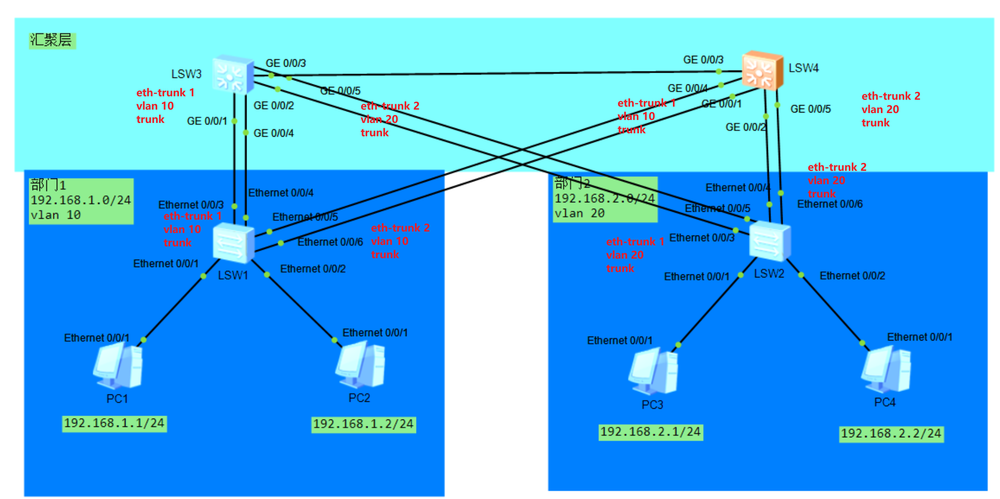

验证

SW1

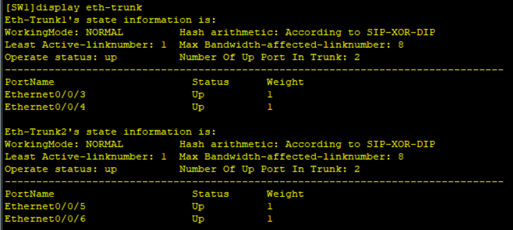

SW2

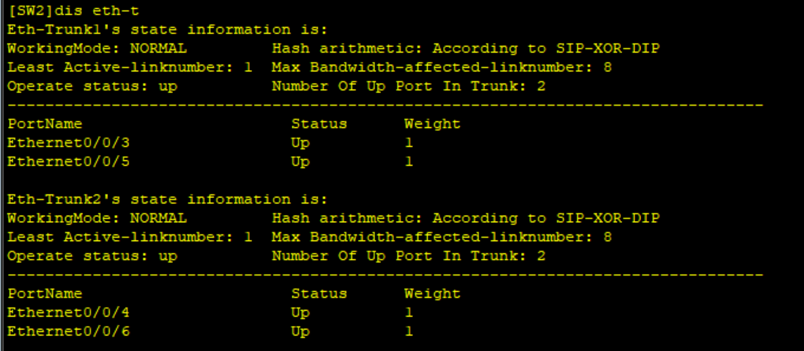

SW3

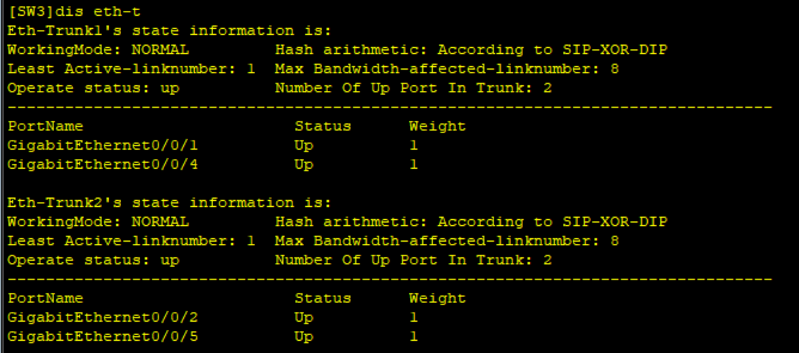

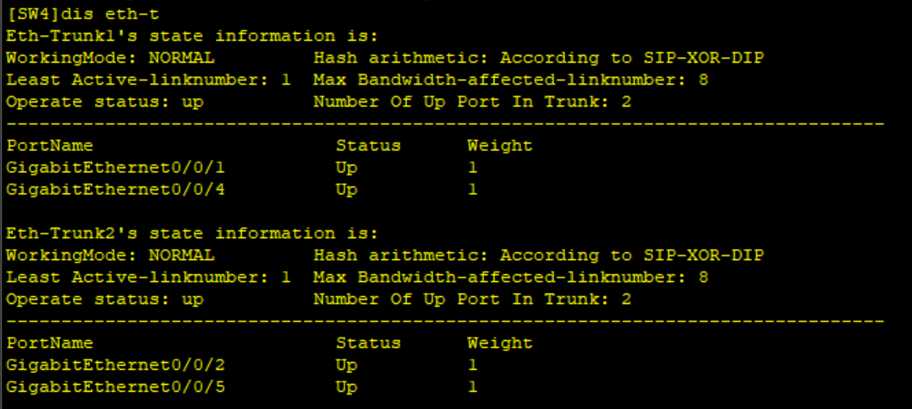

## 连通外界

### 添加设备

添加一台核心交换机CE12800，连接SW3和SW4

添加一条防火墙VSG6000V

默认用户：admin

默认密码：Admin@123

更新后密码：Admin@1234

添加2台出口路由器AR2200，另外一台模拟外网对端路由器

增加外部PC模拟外部用户

两台路由器之间组广域网Serial连接

### 规划ip

SW5：G1/0/1：192.168.10.1/24，G1/0/2：192.168.20.1/24，G1/0/0：192.168.30.1/24

SW3：G0/0/6：192.168.10.2/24

SW4：G0/0/6：192.168.20.2/24

FW1：G1/0/0：192.168.30.2/24，G0/0/0：192.168.40.1/24

AR1：G0/0/0：192.168.40.2/24，S1/0/0：10.0.0.1/24

AR2：S1/0/0：10.0.0.2/24，G0/0/1：192.168.100.1/24

PC5：192.168.100.2/24

### 配置接口ip

#### 交换机配置

后来发现S5700不支持路由模式

只能配vlanif了

```
SW5
[~HUAWEI]sysname SW5
[*HUAWEI]vlan batch 100 200
[*HUAWEI]interface Vlanif 100
[*HUAWEI-Vlanif100]ip address 192.168.10.1 24
[*HUAWEI-Vlanif100]undo shutdown
[*HUAWEI-Vlanif100]interface Vlanif 200
[*HUAWEI-Vlanif200]ip address 192.168.20.1 24
[*HUAWEI-Vlanif200]undo shutdown
[*HUAWEI-Vlanif200]interface GigabitEthernet1/0/1
[*HUAWEI-GE1/0/1]port link-type access
[*HUAWEI-GE1/0/1]port default vlan 100
[*HUAWEI-GE1/0/1]undo shuwdown
[*HUAWEI-GE1/0/1]interface GigabitEthernet1/0/2
[*HUAWEI-GE1/0/2]port link-type access
[*HUAWEI-GE1/0/2]port default vlan 200
[*HUAWEI-GE1/0/2]undo shuwdown
[*HUAWEI-GE1/0/2]interface GigabitEthernet1/0/0
[*HUAWEI-GE1/0/0]undo portswitch
[*HUAWEI-GE1/0/0]ip address 192.168.30.1 24
[*HUAWEI-GE1/0/0]undo shutdown
[*HUAWEI-GE1/0/0]quit
[*HUAWEI]commit
```

```
SW3
[SW3]vlan 100
[SW3-vlan100]interface Vlanif 100
[SW3-Vlanif100]ip address 192.168.10.2 24
[SW3-Vlanif100]interface GigabitEthernet0/0/6
[SW3-GigabitEthernet0/0/6]portswitch 
[SW3-GigabitEthernet0/0/6]port link-type access
[SW3-GigabitEthernet0/0/6]port default vlan 100
```

```
SW4
[SW4]vlan 200
[SW4-vlan200]interface Vlanif 200
[SW4-Vlanif200]ip address 192.168.20.2 24
[SW4-Vlanif200]interface GigabitEthernet0/0/6
[SW4-GigabitEthernet0/0/6]port link-type access
[SW4-GigabitEthernet0/0/6]port default vlan 200
```

#### 防火墙配置

给接口配ip后还需要给接口加入区域

g1/0/0加入trust区域，85优先级

g0/0/0加入untrust区域，优先级5

设置区域访问规则

local和trust互通

trust可以进untrust

untrust不准进trust

```
FW1
<USG6000V1>system-view
[USG6000V1]undo info-center enable
[USG6000V1]sysname FW1
[FW1]interface GigabitEthernet1/0/0
[FW1-GigabitEthernet1/0/0]ip address 192.168.30.2 24
[FW1-GigabitEthernet1/0/0]interface GigabitEthernet0/0/0
[FW1-GigabitEthernet1/0/1]ip address 192.168.40.1 24
[FW1]firewall zone trust 
[FW1-zone-trust]add interface GigabitEthernet1/0/0
[FW1-zone-trust]firewall zone untrust 
[FW1-zone-untrust]add interface GigabitEthernet1/0/1

[FW1]security-policy
[FW1-policy-security]rule name permit_local_to_trust
[FW1-policy-security-rule-permit_local_to_trust]source-zone local 
[FW1-policy-security-rule-permit_local_to_trust]destination-zone trust 
[FW1-policy-security-rule-permit_local_to_trust]action permit 

[FW1-policy-security]rule name permit_trust_to_local
[FW1-policy-security-rule-permit_trust_to_local]source-zone trust
[FW1-policy-security-rule-permit_trust_to_local]destination-zone local
[FW1-policy-security-rule-permit_trust_to_local]action permit 

[FW1-policy-security]rule name permit_trust_to_untrust
[FW1-policy-security-rule-permit_trust_to_untrust]source-zone trust 
[FW1-policy-security-rule-permit_trust_to_untrust]destination-zone untrust
[FW1-policy-security-rule-permit_trust_to_untrust]action permit
```

USG 防火墙默认不允许其他设备 ping 防火墙本身的接口

所以SW5ping防火墙需要在服务管理允许接口1/0/0的ping命令

```
[FW1]interface GigabitEthernet1/0/0
[FW1-GigabitEthernet1/0/0]service-manage ping permit
```

目前放行了三条

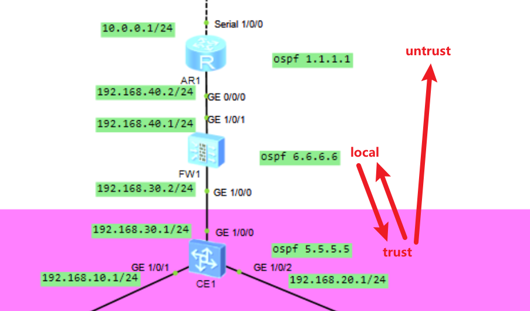

#### 路由器配置

```
R1
<Huawei>system-view
[Huawei]sysname R1
[R1]undo info-center enable
[R1]interface GigabitEthernet0/0/0
[R1-GigabitEthernet0/0/0]ip address 192.168.40.2 24
[R1-GigabitEthernet0/0/0]interface Serial1/0/0
[R1-Serial1/0/0]ip address 10.0.0.1 24
```

```
R2
<Huawei>system-view
[Huawei]sysname R2
[R2]undo info-center enable
[R2]interface Serial1/0/0
[R2-Serial1/0/0]ip address 10.0.0.2 24
[R2-Serial1/0/0]interface GigabitEthernet0/0/1
[R2-GigabitEthernet0/0/1]ip address 192.168.100.1 24
```

当前拓扑图：

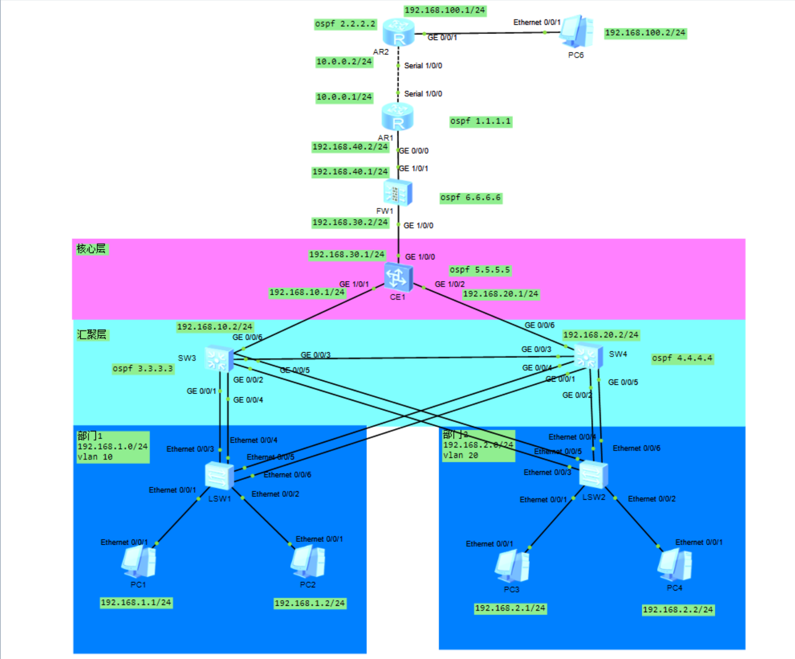

### OSPF路由配置

```
SW3
[SW3]ospf 1 router-id 3.3.3.3
[SW3-ospf-1]area 0
[SW3-ospf-1-area-0.0.0.0]network 192.168.10.0 0.0.0.255
[SW3-ospf-1-area-0.0.0.0]network 192.168.1.0 0.0.0.255
[SW3-ospf-1-area-0.0.0.0]network 192.168.2.0 0.0.0.255
```

```
SW4
[SW4]ospf 1 router-id 4.4.4.4
[SW4-ospf-1]area 0
[SW4-ospf-1-area-0.0.0.0]network 192.168.20.0 0.0.0.255
[SW4-ospf-1-area-0.0.0.0]network 192.168.1.0 0.0.0.255
[SW4-ospf-1-area-0.0.0.0]network 192.168.2.0 0.0.0.255
```

```
SW5
[~SW5]ospf 1 router-id 5.5.5.5
[*SW5-ospf-1]area 0
[*SW5-ospf-1-area-0.0.0.0]network 192.168.10.0 0.0.0.255
[*SW5-ospf-1-area-0.0.0.0]network 192.168.20.0 0.0.0.255
[*SW5-ospf-1-area-0.0.0.0]network 192.168.30.0 0.0.0.255
[*SW5-ospf-1-area-0.0.0.0]q
[*SW5-ospf-1]q
[*SW5]commit
```

```
FW1
[FW1]ospf 1 router-id 6.6.6.6
[FW1-ospf-1]area 0
[FW1-ospf-1-area-0.0.0.0]network 192.168.30.0 0.0.0.255
[FW1-ospf-1-area-0.0.0.0]network 192.168.40.0 0.0.0.255
```

```
R1
[R1]ospf 1 router-id 1.1.1.1
[R1-ospf-1]area 0
[R1-ospf-1-area-0.0.0.0]network 192.168.40.0 0.0.0.255
[R1-ospf-1-area-0.0.0.0]network 10.0.0.0 0.0.0.255
```

```
R2
[R2]ospf 1 router-id 2.2.2.2
[R2-ospf-1]area 0
[R2-ospf-1-area-0.0.0.0]network 10.0.0.0 0.0.0.255
[R2-ospf-1-area-0.0.0.0]network 192.168.100.0 0.0.0.255
```

建立ospf时需要local到untrust

```
[FW1]security-policy 
[FW1-policy-security]rule name permit_local_to_untrust	
[FW1-policy-security-rule-permit_local_to_untrust]source-zone local 
[FW1-policy-security-rule-permit_local_to_untrust]destination-zone untrust 
[FW1-policy-security-rule-permit_local_to_untrust]action permit 
[FW1-policy-security-rule-permit_local_to_untrust]rule name permit_untrust_to_local
[FW1-policy-security-rule-permit_untrust_to_local]source-zone untrust 
[FW1-policy-security-rule-permit_untrust_to_local]destination-zone local 
[FW1-policy-security-rule-permit_untrust_to_local]action permit 
```

当前防火墙放行策略：
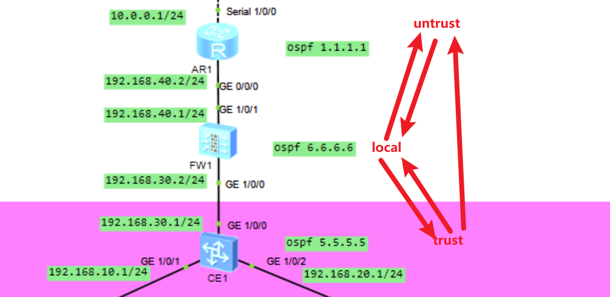

用PC1 ping PC5：
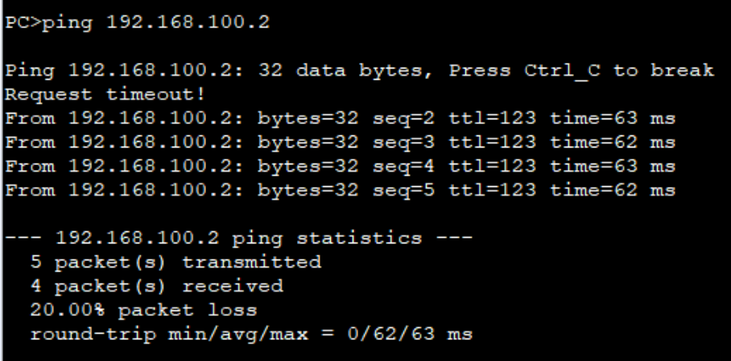

显然可通，证明ospf配置完成

而PC5

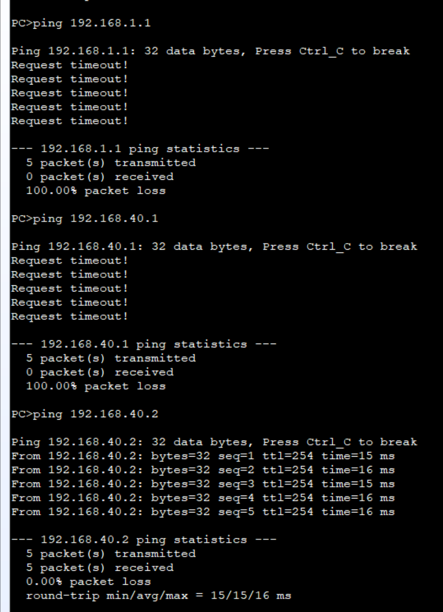

过不去防火墙，最多到达192.168.40.0/24网络中
