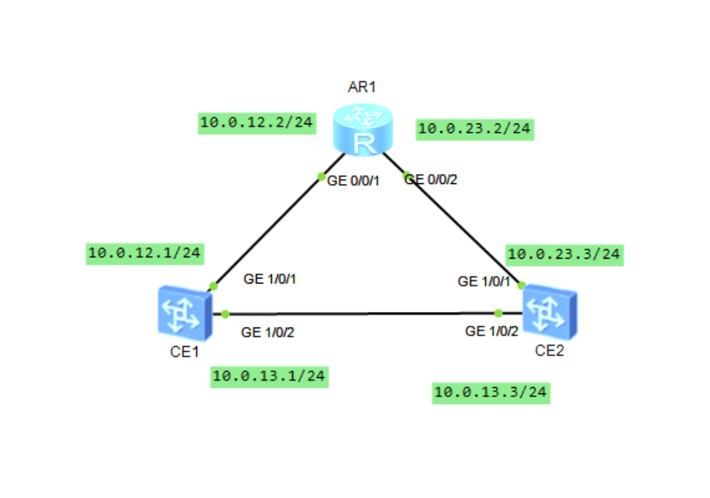
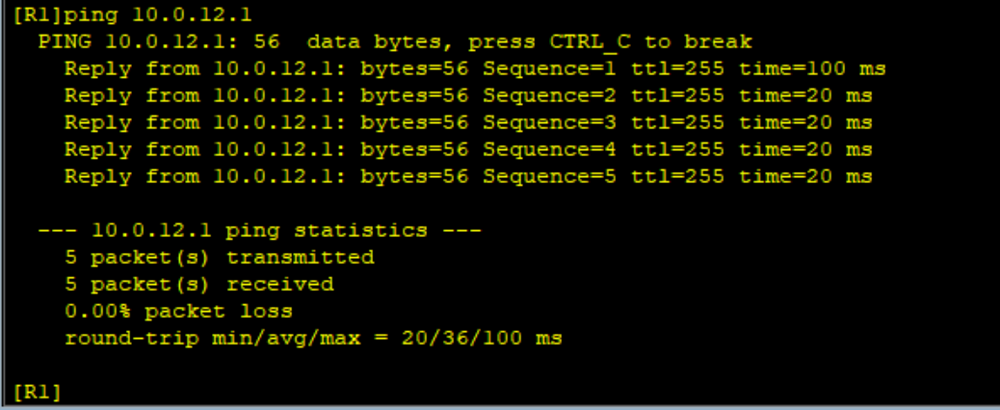
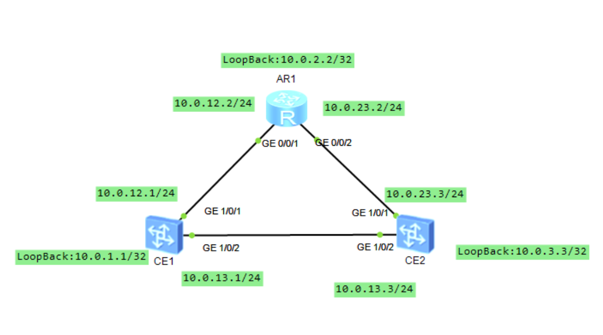
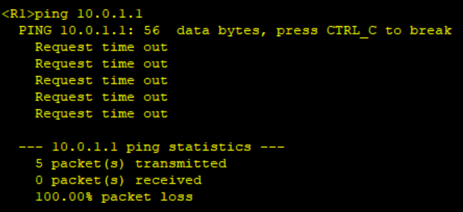
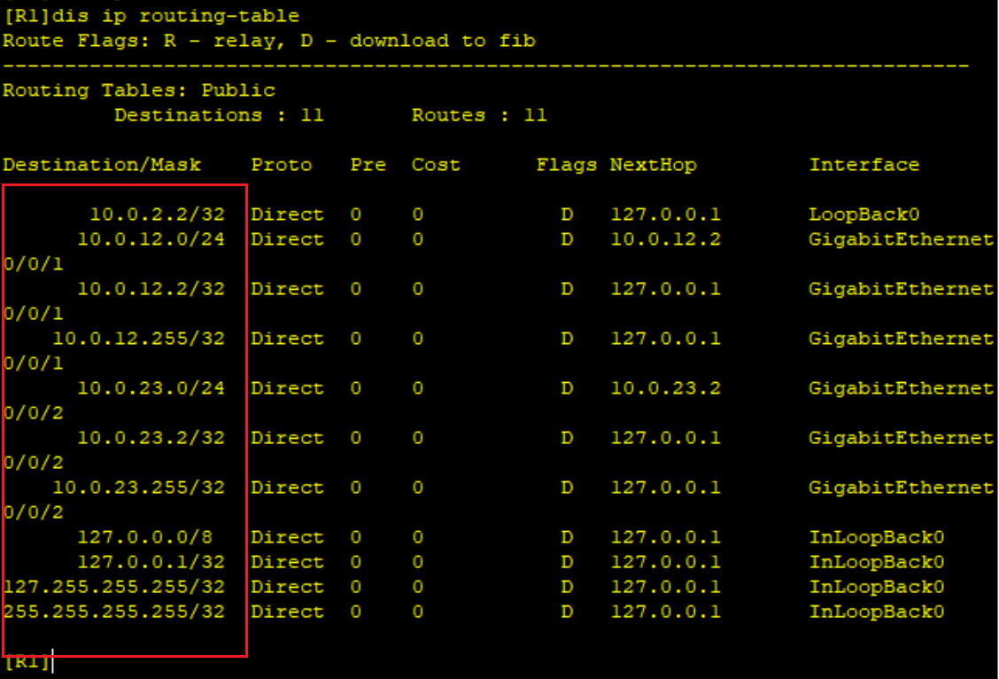
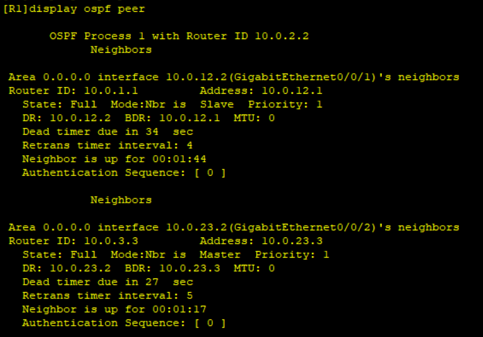
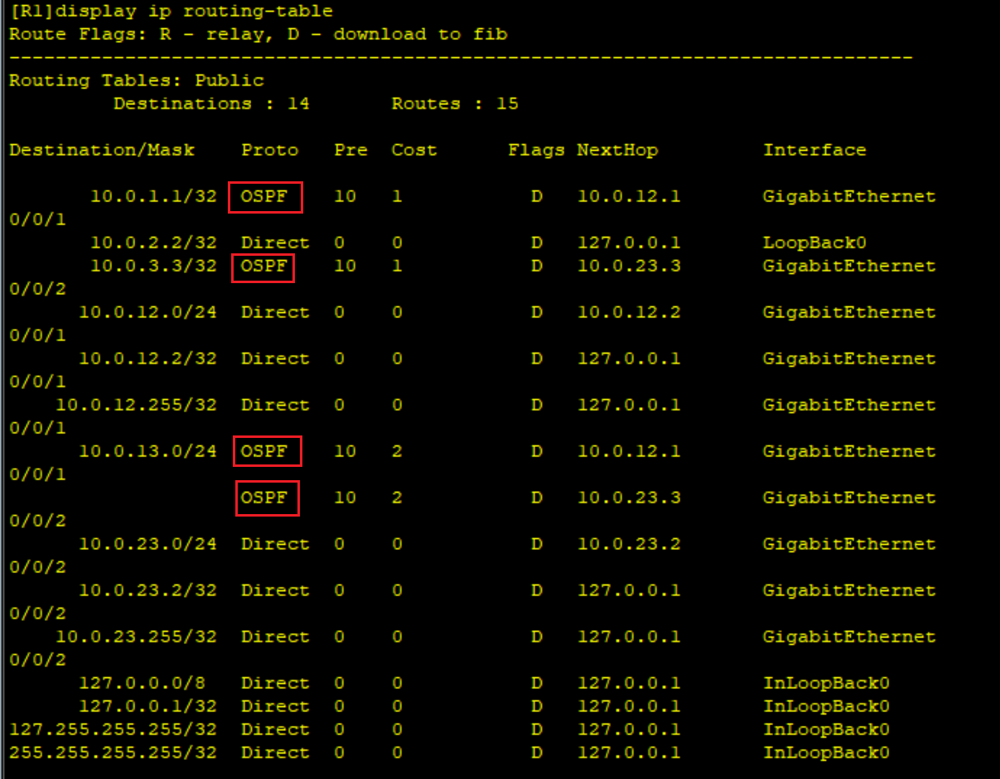

# OSPF

## 网络拓扑图



## 在路由器上接口配置ip

```shell
R1
sys
undo in en
sysname R1
int g0/0/1
ip add 10.12.2 24
int g0/0/2
ip add 10.0.23.2 24
```

## 在交换机上关闭接口交换，配置ip

注意，此处使用的是核心交换机CE12800，否则无法关闭交换模式给接口配置ip

还有，配置完成后需要使用commit命令提交生效，再把接口启用！！！undo shutdown

```shell
SW1
sys
undo in en
sysname SW1
int g1/0/1
undo portswitch
ip add 10.0.12.1 24
undo shutdown
int g1/0/2
undo portswitch
ip add 10.0.13.1 24
undo shutdown
q
commit
```

```shell
SW2
sys
undo in en
sysname SW2
int g1/0/1
undo portswitch
ip add 10.0.23.1 24
undo shutdown
int g1/0/2
undo portswitch
ip add 10.0.13.3 24
undo shutdown
q
commit
```

配置完路由之间是直连路由可以互通



## 配置回环接口

相当于在三个设备外再接了一个路由

```shell
R1
int loopback 0
ip add 10.0.2.2 32
```

```shell
SW1
int loopback 0
ip add 10.0.1.1 32
q
commit
```

```shell
SW2
int loopback 0
ip add 10.0.3.3 32
q
commit
```

此时拓扑



显然，没有路由，ping不通



显然没有10.0.1.1和10.0.3.3



## 配置ospf

```shell
R1
[R1]ospf 1
[R1-ospf-1]area 0
[R1-ospf-1-area-0.0.0.0]network 10.0.12.2 0.0.0.255
[R1-ospf-1-area-0.0.0.0]network 10.0.23.2 0.0.0.255
[R1-ospf-1-area-0.0.0.0]network 10.0.2.2 0.0.0.0
[R1-ospf-1-area-0.0.0.0]q
[R1-ospf-1]q
```

```shell
SW1
[~SW1]ospf
[*SW1-ospf-1]area 0
[*SW1-ospf-1-area-0.0.0.0]network 10.0.12.1 0.0.0.0
[*SW1-ospf-1-area-0.0.0.0]network 10.0.13.1 0.0.0.0
[*SW1-ospf-1-area-0.0.0.0]network 10.0.1.1 0.0.0.0
[*SW1-ospf-1-area-0.0.0.0]q
[*SW1-ospf-1]q
[*SW1]commit
```

```shell
SW2
[~SW2]ospf
[*SW2-ospf-1]area 0
[*SW2-ospf-1-area-0.0.0.0]network 10.0.13.3 0.0.0.0
[*SW2-ospf-1-area-0.0.0.0]network 10.0.23.3 0.0.0.0
[*SW2-ospf-1-area-0.0.0.0]network 10.0.3.3 0.0.0.0
[*SW2-ospf-1-area-0.0.0.0]q
[*SW2-ospf-1]q
[*SW2]commit
```

## 配置router-id

```shell
R1
ospf 1 router-id 10.0.2.2
ret
reset ospf 1 process
```

```shell
SW1
ospf 1 router-id 10.0.1.1
ret
reset ospf 1 process
```

```shell
SW2
ospf 1 router-id 10.0.3.3
ret
reset ospf 1 process
```

配置router-id为当前设备回环地址ip然后重启ospf进程，等待数秒

查看ospf邻居表



查看路由表

