# server服务器

## 网络拓扑图

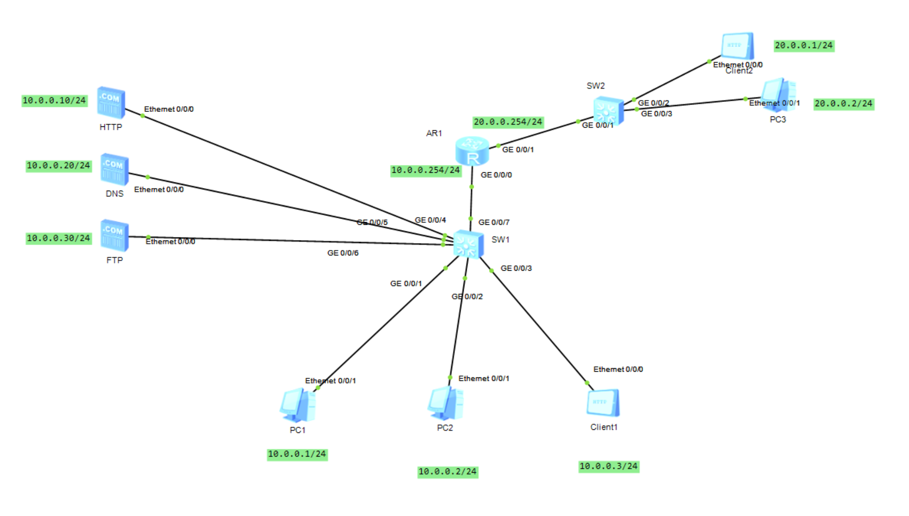

## DHCP

ensp没有dhcp服务器但路由器可以替代

建一个地址池zzjdhcp

分配在10.0.0.0网络中，掩码255.255.255.0

网关10.0.0.254

dns10.0.0.254

排除10.0.0.1~10.0.0.30之间的地址

租期10天

```shell
R1
sys
undo in en
sys R1
int g0/0/0
ip add 10.0.0.254 24
int g0/0/1
ip add 20.0.0.254 24
q
[R1]ip pool zzjdhcp
[R1-ip-pool-zzjdhcp]network 10.0.0.0 mask 255.255.255.0
[R1-ip-pool-zzjdhcp]gateway-list 10.0.0.254
[R1-ip-pool-zzjdhcp]dns-list 10.0.0.254
[R1-ip-pool-zzjdhcp]excluded-ip-address 10.0.0.1 10.0.0.30
[R1-ip-pool-zzjdhcp]lease day 10
```

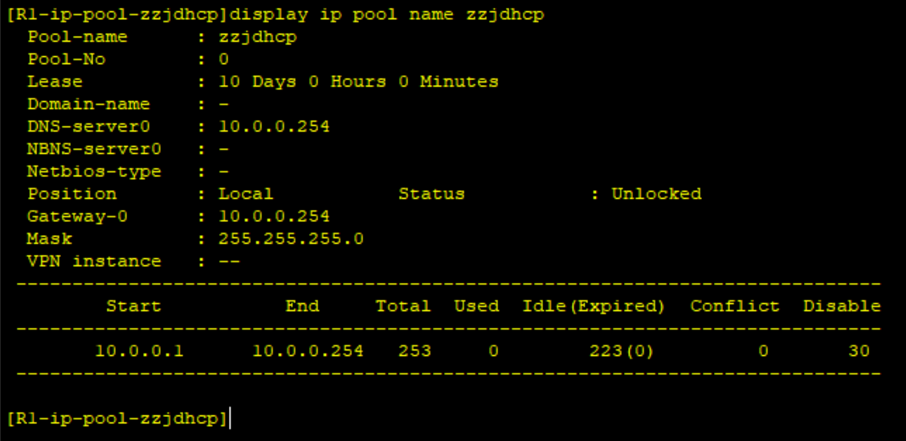

```shell
[R1]dhcp enable
[R1-GigabitEthernet0/0/0]dhcp select global 
```

启用dhcp，在接口处选择全局

把PC1的dhcp打开

对路由器g0/0/0抓包可见分配到10.0.0.253的地址

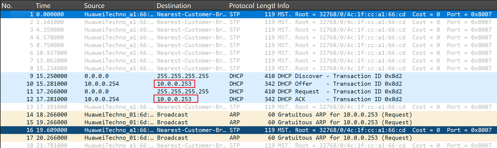

## HTTP

给服务器配好地址和网关

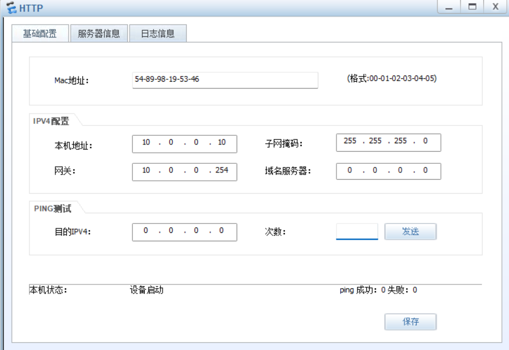

放一个文件，打开http服务

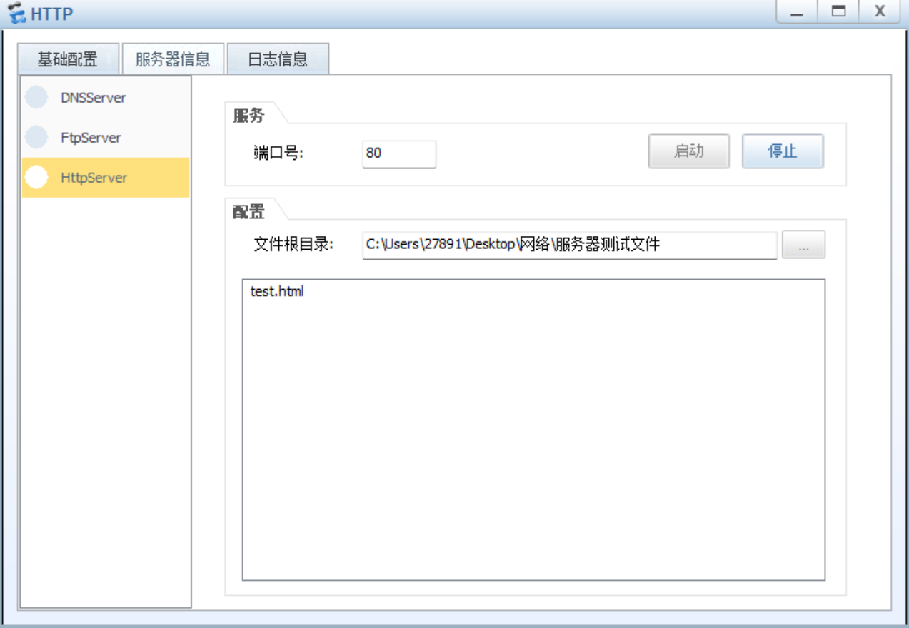

客户机配好ip和网关，ping通服务器

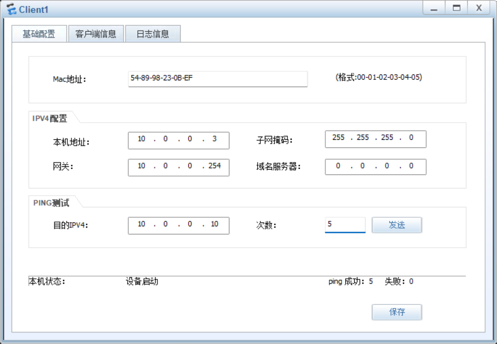

访问服务器地址和文件名，可以获取到文件

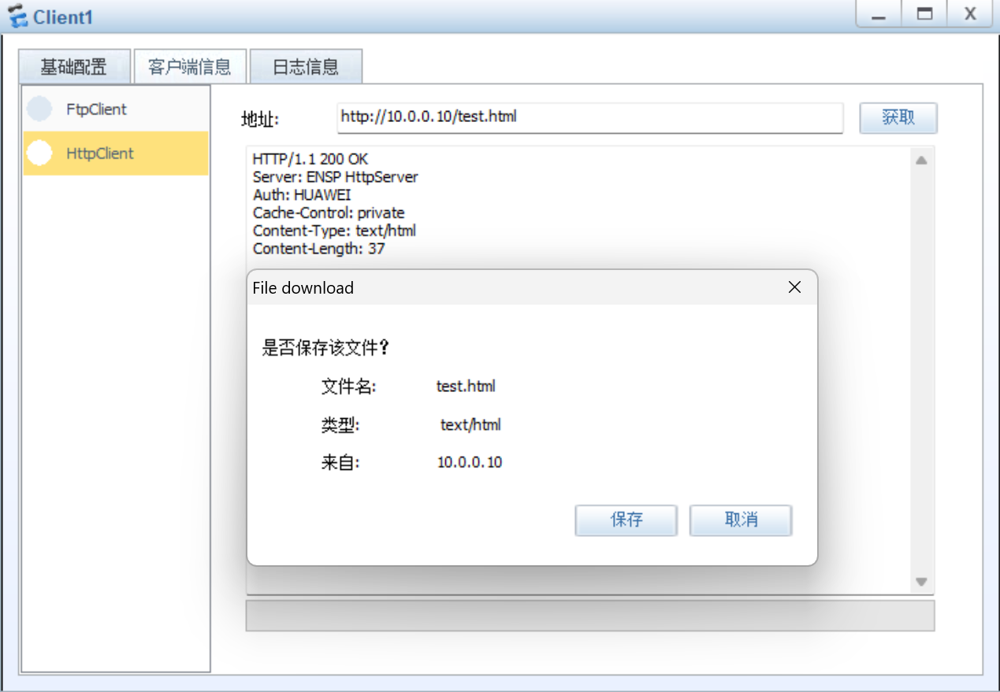

顺便补一下上次nat server

在R1出口接口g0/0/1开启端口映射

```shell
[R1-GigabitEthernet0/0/1]nat server protocol tcp global current-interface 8080 inside 10.0.0.10 80
```

可以使外网只访问g0/0/1的8080端口就到达http服务器

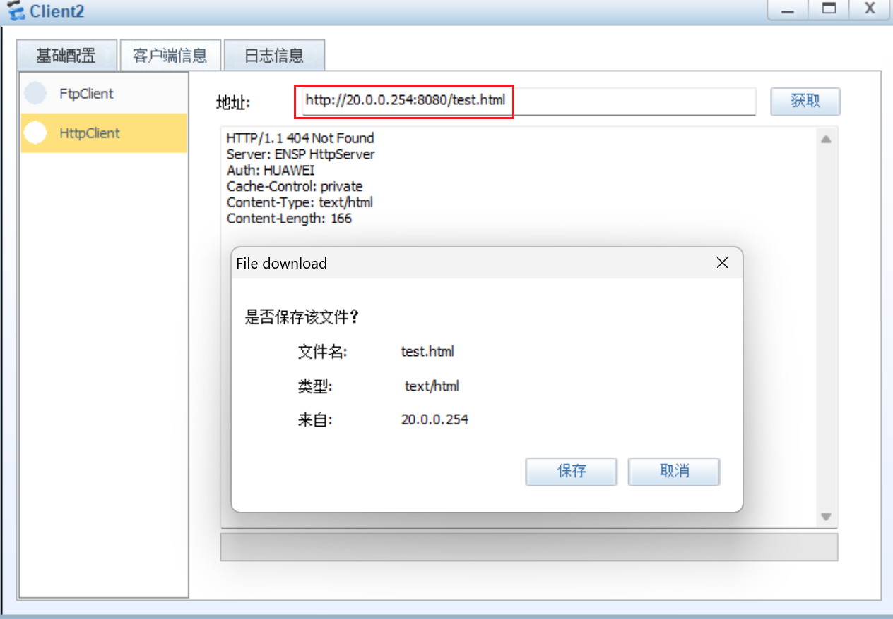

## DNS

配置DNS服务器ip和网关

加入一条地址和域名的映射关系

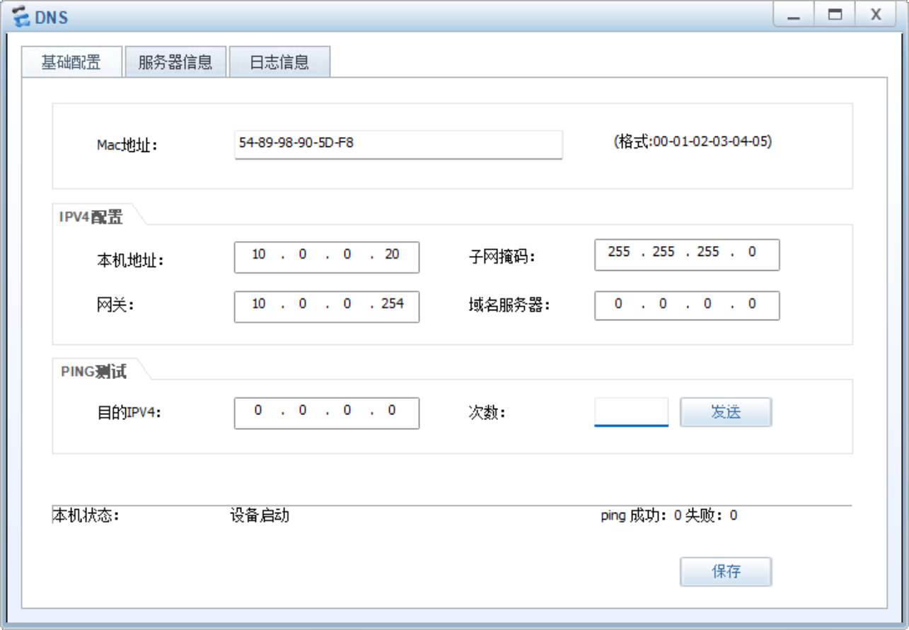

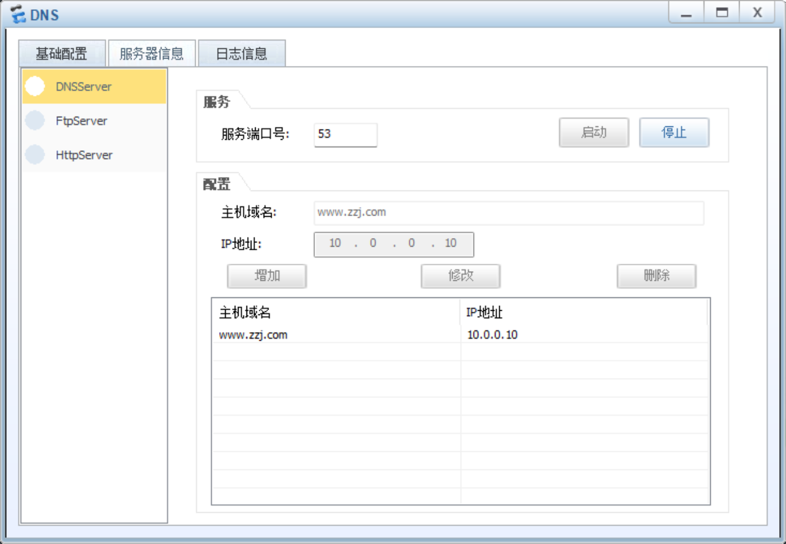

在客户机上配置DNS的ip

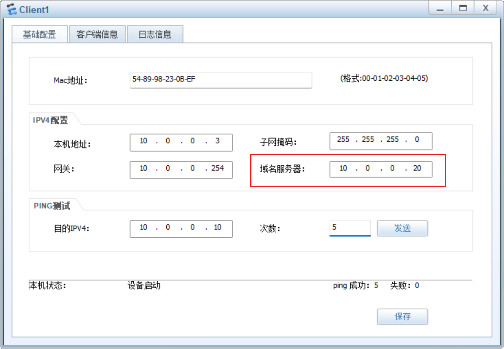

就可以用域名访问刚才的网页

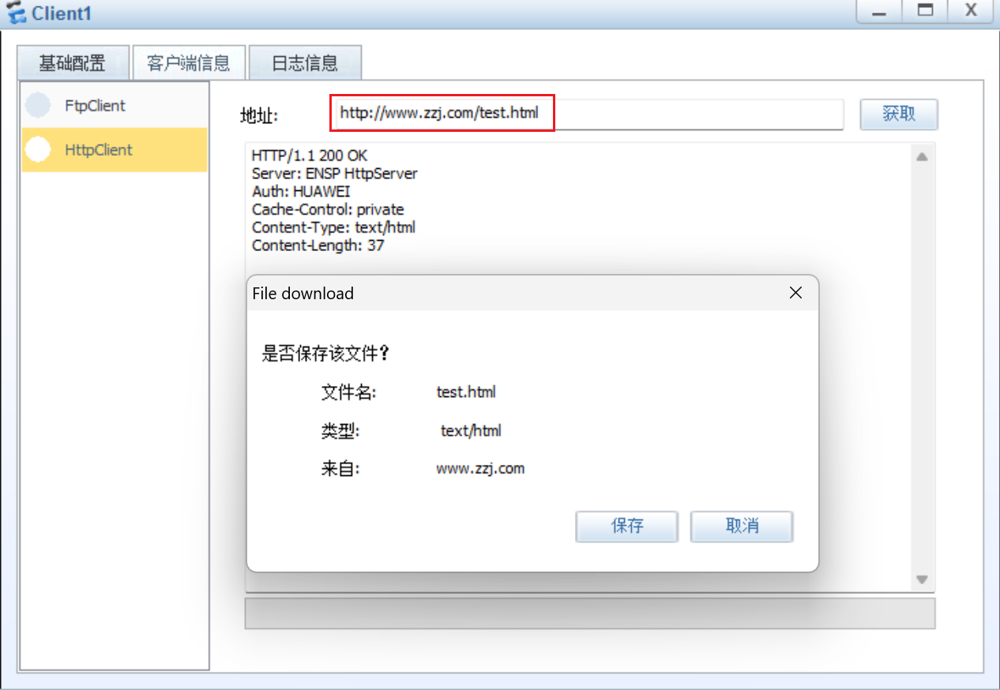

## FTP

先配ip网关

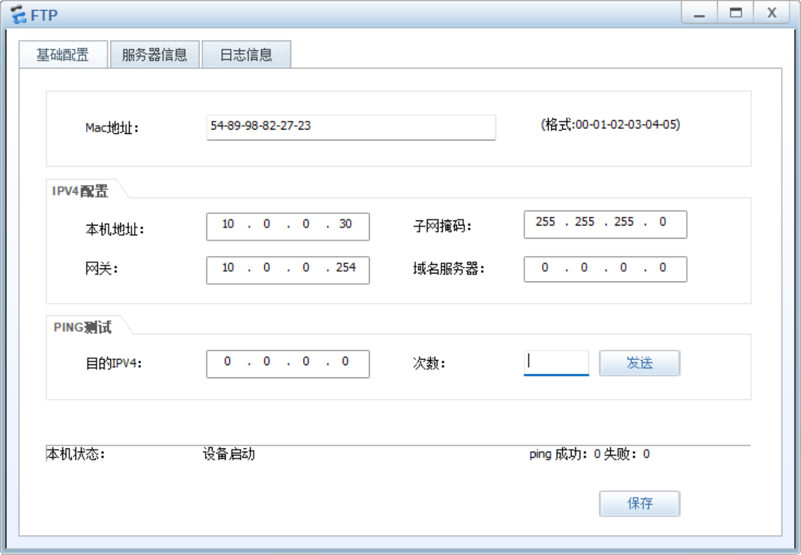

选择文件夹，这些文件将放到ftp展示

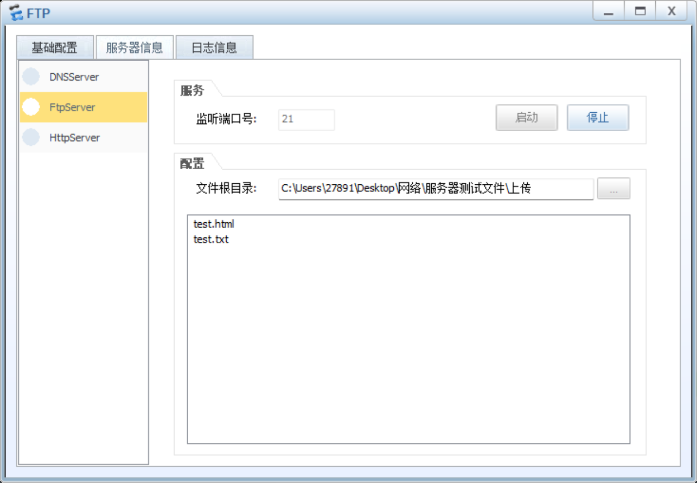

打开客户机就可以在ftp上看到文件

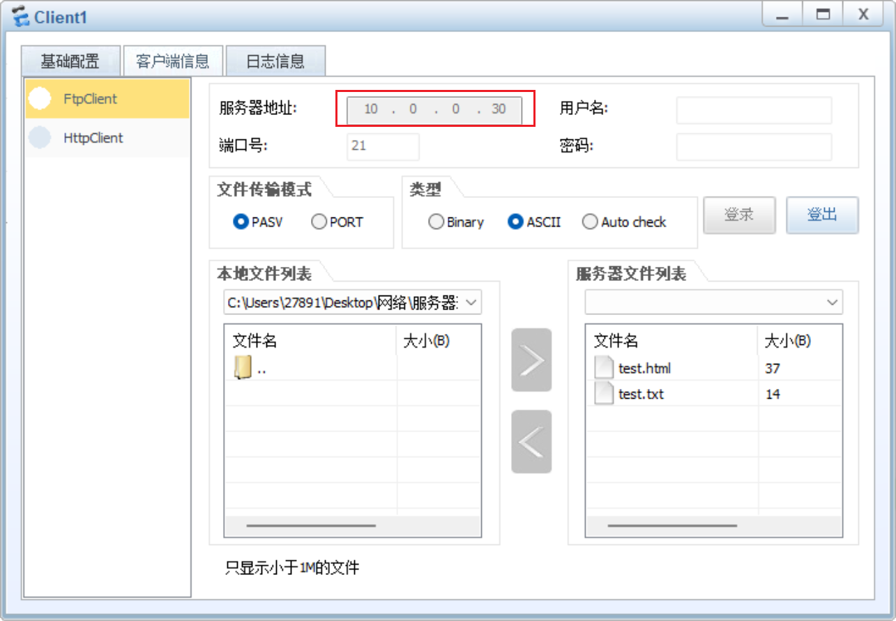

可以上传或者下载文件


