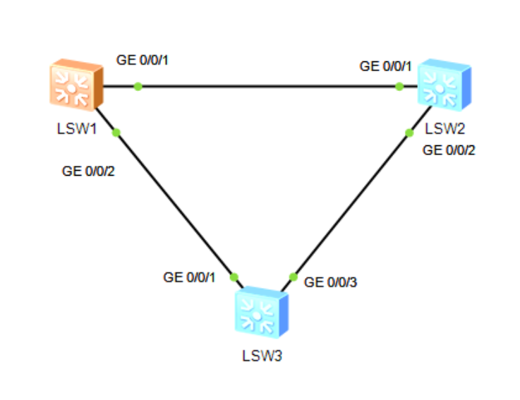
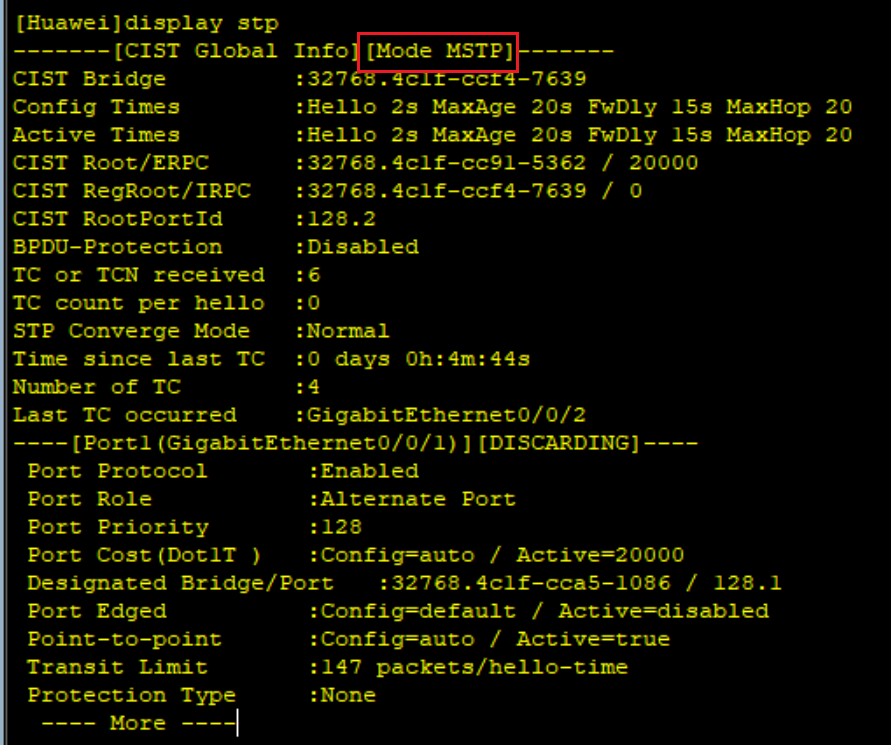
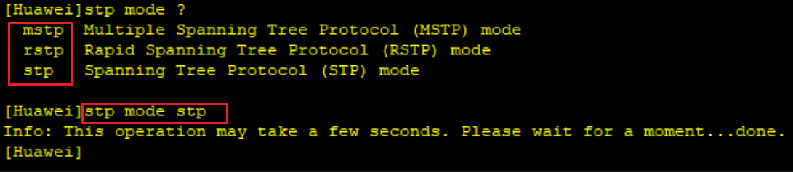
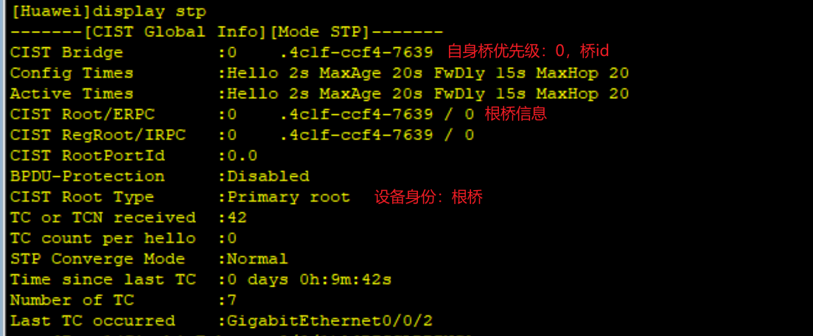
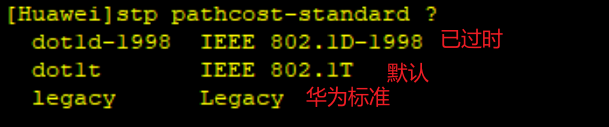
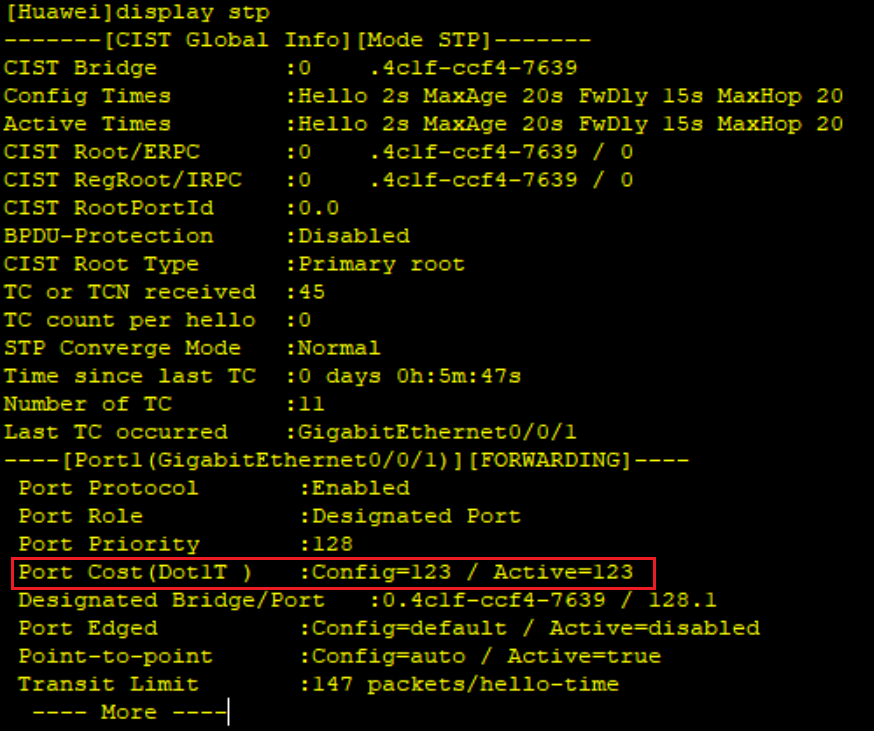
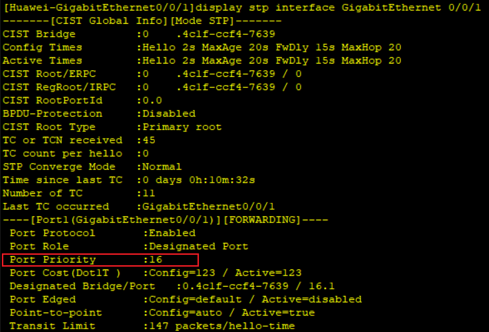
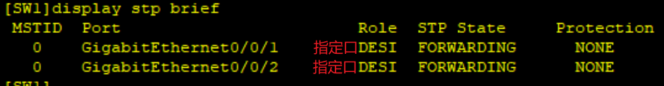
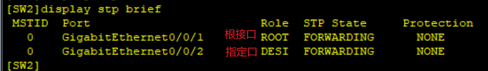
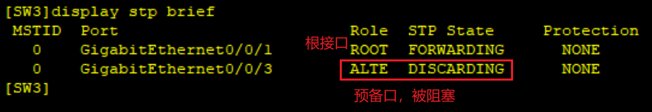

# stp生成树协议

## 网络拓扑图



华为交换机默认使用mstp协议

```shell
system-view
display stp
```



可以修改为stp模式

```shell
stp mode stp
```



可以自定义主/备根桥：
主根桥优先级0，备根桥优先级4096

```shell
stp root primary
stp root secondary
```

也可手动修改优先级：优先级默认32768，但已经设为主备根桥的设备不能修改优先级

```shell
stp priority 4096
```



设置接口路径开销：



```shell
interface GigabitEthernet 0/0/1
stp cost 123
```



设置接口优先级：

需为16倍数

```shell
interface GigabitEthernet 0/0/1
stp port priority 16
display stp interface GigabitEthernet 0/0/1
```



开启/关闭生成树协议：默认开启，可全局开关，也可进到接口开关

```shell
stp enable
stp disable
```

最后查看接口状态：

```shell
display stp brief
```





