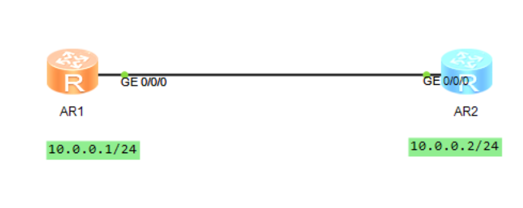
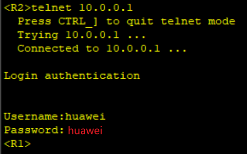
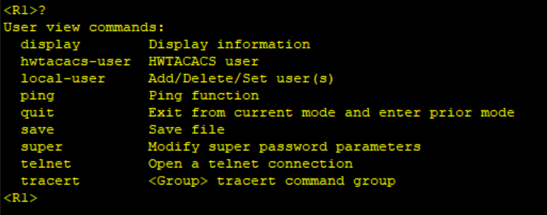

# telnet

## 网络拓扑图



## 配置

先配置aaa用户

账号密码huawei，服务类型telnet，权限0

```shell
R1
[R1]aaa
[R1-aaa]local-user huawei password cipher huawei
[R1-aaa]local-user huawei service-type telnet
[R1-aaa]local-user huawei privilege level 0
q

```

进入用户接口vty 0~4认证方式为aaa

```shell
[R1]user-interface vty 0 4
[R1-ui-vty0-4]authentication-mode aaa
```

然后R2可以登录R1了



由于权限是0，所以只有这些功能：
