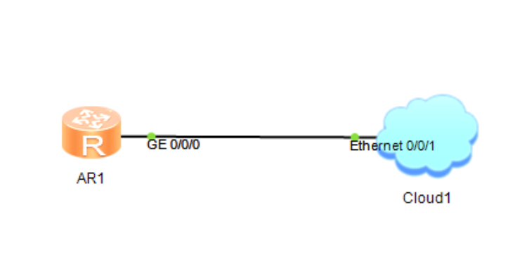
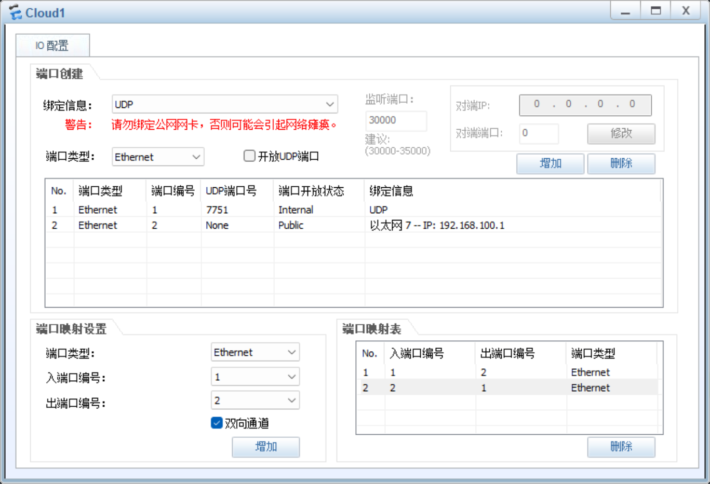
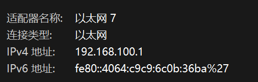
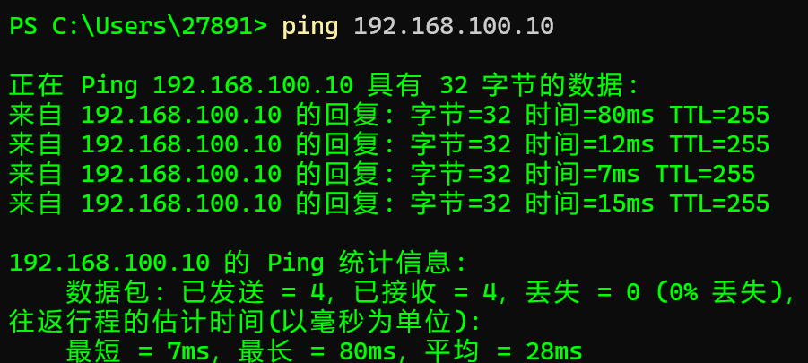
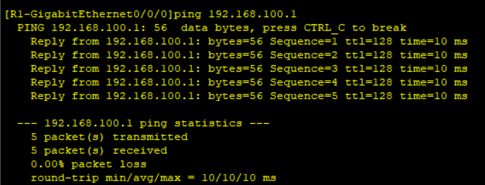
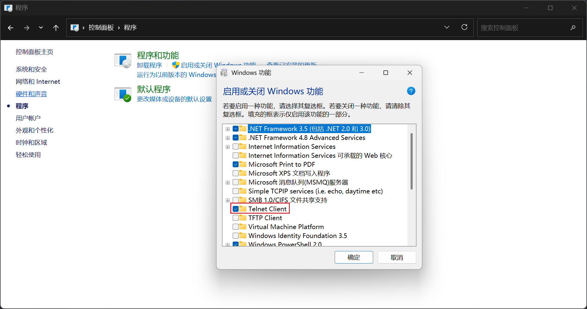
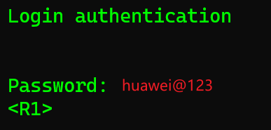
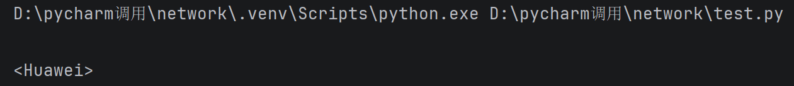

# telnetlib

## 网络拓扑图



## 云配置



路由器接口ip需要在云连接的本地电脑网卡的同一个网络内



```shell
R1
<Huawei>sys
[Huawei]undo in en
[Huawei]sys R1
[R1]int g0/0/0
[R1-GigabitEthernet0/0/0]ip add 192.168.100.10 24
```



关闭本地电脑防火墙



R1配置虚拟vty

```shell
[R1]user-interface vty 0 4
Please configure the login password (maximum length 16):huawei@123
```

## telnet连接

先开启电脑telnet



打开终端

```shell
telnet 192.168.100.10
```



## python脚本编写

telnetlib库从python3.11起被移除

现在可以安装telnetlib3

```shell
pip install telnetlib3
```

```python
import telnetlib3

host = '192.168.100.10'
password = 'huawei@123'

tn = telnetlib3.Telnet(host)
tn.read_until(b'Password:')    #读取，直到读到Password:为止，b：二进制字节。telnet输出位二进制字节
tn.write(password.encode('ascii') + b'\n')    #写入密码并回车
print(tn.read_until(b'<Huawei>').decode('ascii'))    #打印路由器的显示直到出现<Huawei>，即路由器输出完了
tn.close()
```



可见执行成功