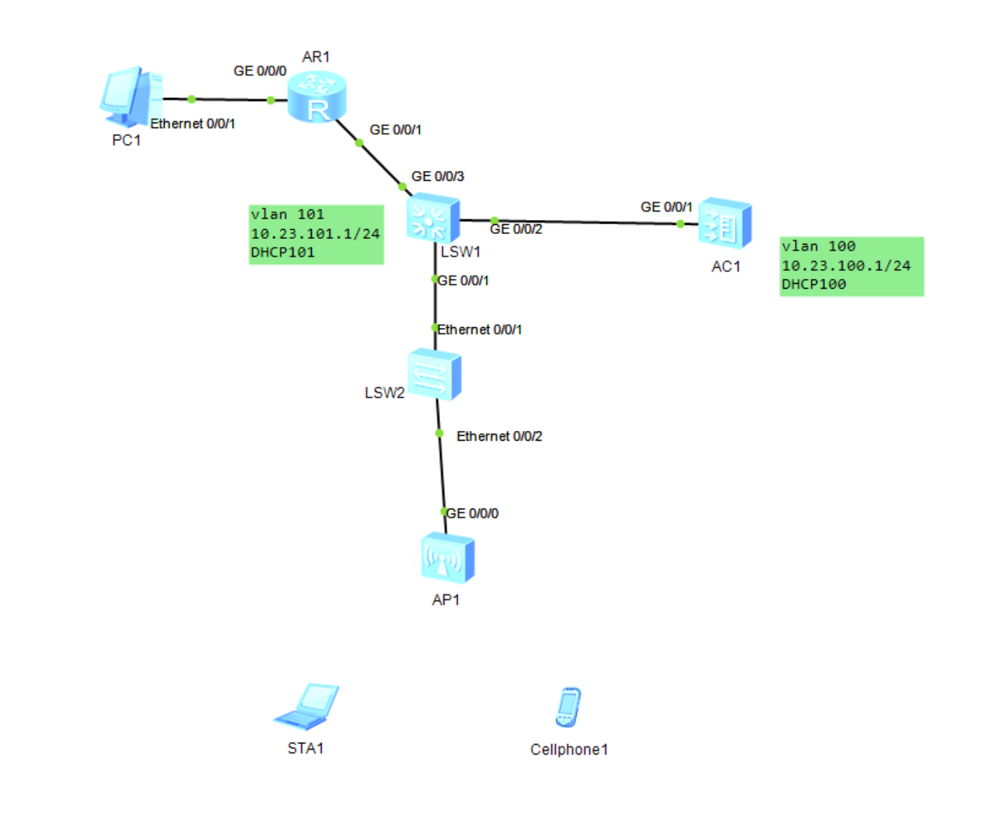
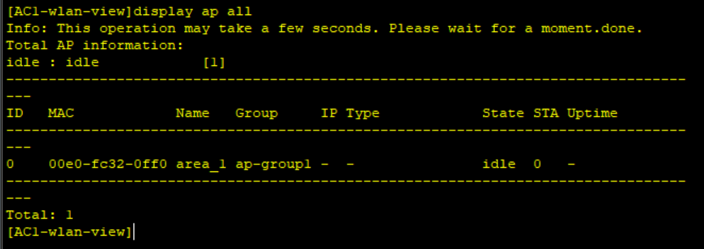
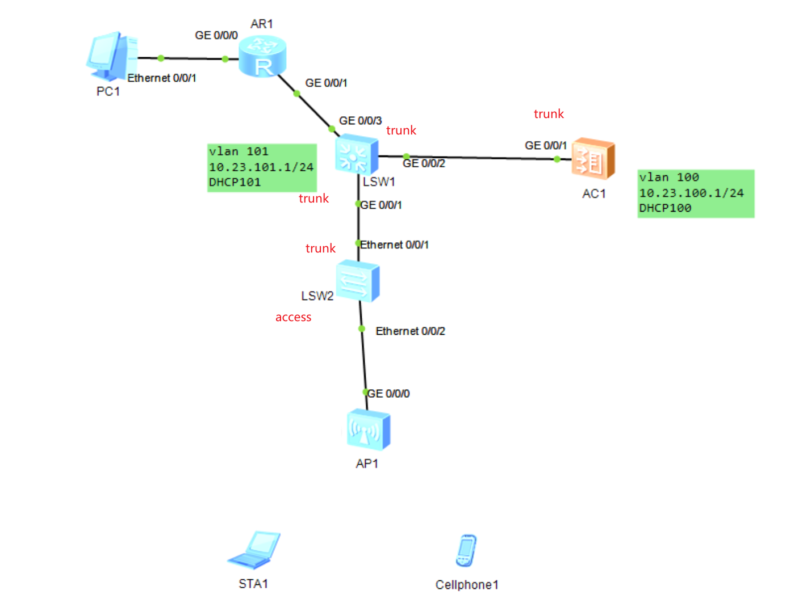
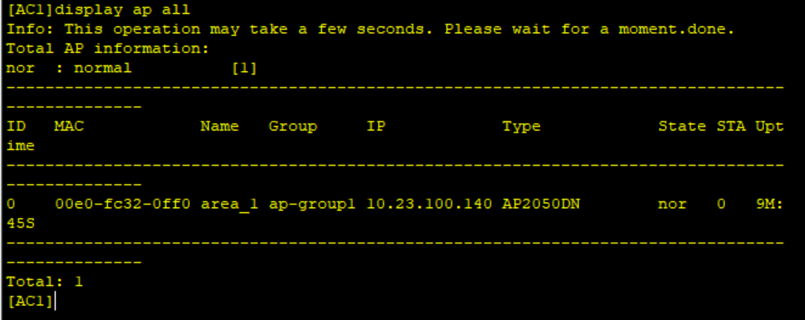
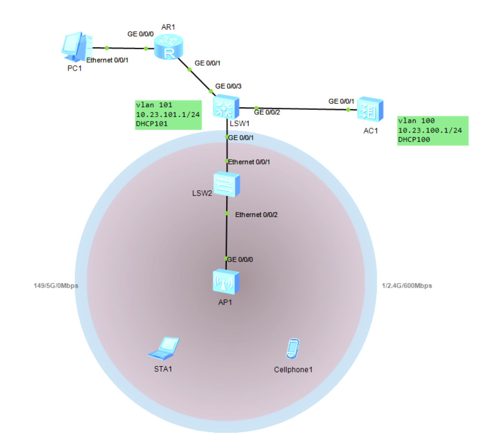
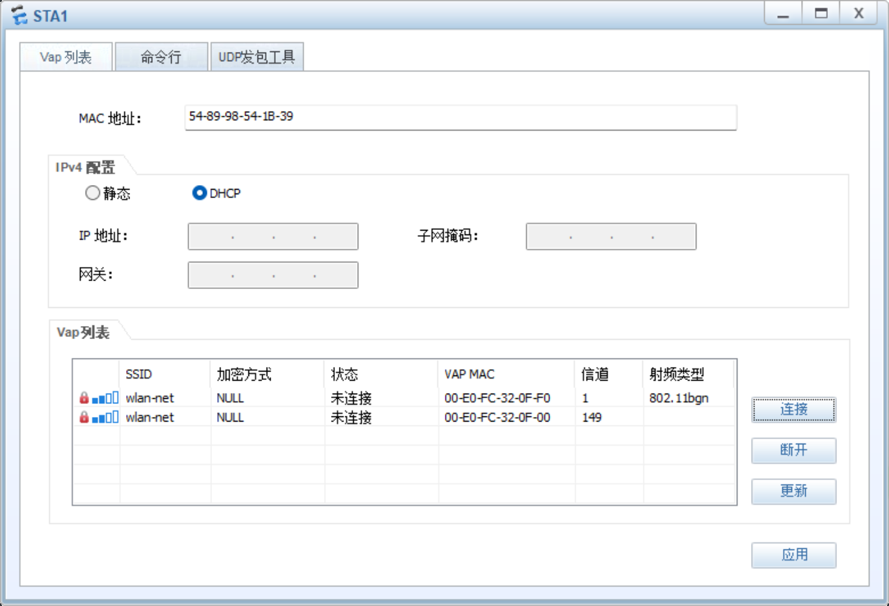
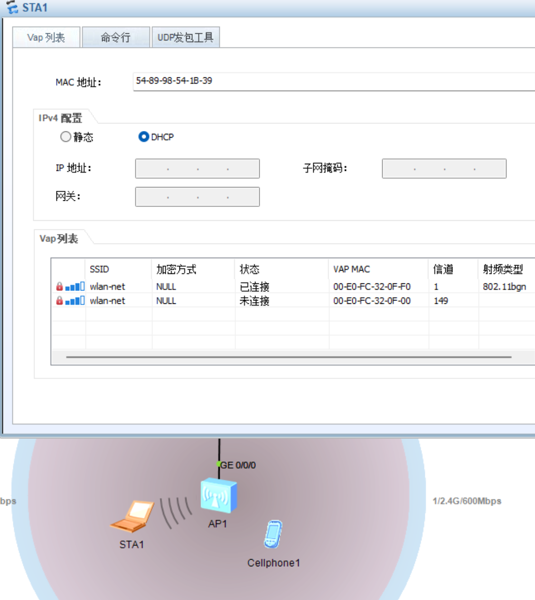

# WLAN

## 网络拓扑图



ap的dhcp由ac分配

终端的dhcp由核心交换机SW1分配

## 先开vlan和dhcp

```shell
AC1
sys
undo in en
sys AC1
dhcp enable
vlan batch 100 101
int vlanif 100
ip add 10.23.100.1 24
dhcp select interface
```

```shell
SW1
sys
undo in en
sys SW1
dhcp enable
vlan batch 100 101
int vlanif 101
ip add 10.23.101.1 24
dhcp select interface
```

## 创建ap组

创建ap组，起名ap-group1

```shell
[AC1]wlan
[AC1-wlan-view]ap-group name ap-group1
[AC1-wlan-ap-group-ap-group1]quit
```

## 创建域管理模板

创建模板名字default

进入ap组关联该模板

```shell
[AC1-wlan-view]regulatory-domain-profile name default
[AC1-wlan-regulate-domain-default]country-code cn
[AC1-wlan-regulate-domain-default]q
[AC1-wlan-view]ap-group name ap-group1
[AC1-wlan-ap-group-ap-group1]regulatory-domain-profile default
yes
```

## 配置AC源接口

配置capwap接口为vlanif 100

```shell
[AC1]capwap source interface Vlanif 100
```

## AC离线导入AP

导入模式为mac

创建ap-id 0 绑定设备00E0-FC32-0FF0

ap-name设置为area_1

加入ap组ap-group1

```shell
[AC1]wlan
[AC1-wlan-view]ap auth-mode mac-auth
[AC1-wlan-view]ap-id 0 ap-mac 00E0-FC32-0FF0
[AC1-wlan-ap-0]ap-name area_1
[AC1-wlan-ap-0]ap-group ap-group1
yes
q
```

可见当前ap组1有一个ap，id为0，名称area_1



然后还要给所有的交换机和ac配置vlan接口，此处省略命令

放行vlan100 101



然后就会给ap分配ip了



## 配置WLAN业务参数

### 安全模板

模板名：waln-net

- **security wpa-wpa2**：表示配置 WPA 和 WPA2 的混合认证模式。在这种模式下，无论终端设备支持 WPA 还是 WPA2 协议，都可以成功进行认证并接入网络。
- **psk**：表示采用预共享密钥（Pre-Shared Key）认证方式，这通常也被称为“个人版”模式。它不需要专门的企业级认证服务器，只需在设备端和终端输入相同的密码即可。
- **pass-phrase**：指定密钥的输入格式为“密钥短语”（即常见的明文密码字符串形式），而不是十六进制（hex）格式。
- **a1234567**：这是配置的具体密码（预共享密钥）。该密码长度为 8 个字符，符合 WPA/WPA2-PSK 要求的 8 到 63 个 ASCII 字符的密码长度规范。
- **aes**：指定数据加密算法采用 AES（高级加密标准）。相比于 TKIP，AES 是更安全的加密方式，也是目前推荐的加密标准。

```shell
[AC1-wlan-view]security-profile name wlan-net
[AC1-wlan-sec-prof-wlan-net]security wpa-wpa2 psk pass-phrase a1234567 aes
q
```

### SSID模板

模板名称wlan-net

设置ssid，即wifi名字为wlan-net

```shell
[AC1-wlan-view]ssid-profile name wlan-net
[AC1-wlan-ssid-prof-wlan-net]ssid wlan-net
q
```

### vap模板

模板名称wlan-net

转发模式为tunnel，隧道转发

配置该无线网络使用的业务 VLAN 为 **VLAN 101**。当采用隧道转发模式时，AC 收到 CAPWAP 隧道中的报文后，会剥离隧道头，并为其打上 VLAN 101 的标签，然后在有线网络中进行转发

安全模板和ssid模板用刚才配置好的

```shell
[AC1-wlan-view]vap-profile name wlan-net
[AC1-wlan-vap-prof-wlan-net]forward-mode tunnel
[AC1-wlan-vap-prof-wlan-net]service-vlan vlan-id 101
[AC1-wlan-vap-prof-wlan-net]security-profile wlan-net
[AC1-wlan-vap-prof-wlan-net]ssid-profile wlan-net
q
```

### ap组引用

```shell
[AC1-wlan-view]ap-group name ap-group1
[AC1-wlan-ap-group-ap-group1]vap-profile wlan-net wlan 1 radio 0
[AC1-wlan-ap-group-ap-group1]vap-profile wlan-net wlan 1 radio 1
q
```

- **`vap-profile wlan-net`**：指定要应用的业务模板为之前创建好的 `wlan-net`（包含了 SSID、密码、VLAN 101 和隧道转发等配置）。

- **`wlan 1`**：指定 WLAN 的业务 ID 为 1。这是用来标识当前无线业务的编号。

- **`radio 0`**：指定将该模板绑定到 AP 的 **0 号射频**。在华为设备中，`radio 0` 通常代表 **2.4G 射频**（`radio 1` 通常代表 5G 射频）。

  

## 连接WLAN

密码是a1234567



显然信道149是5GHz的信号



5gHz有bug连不上？暂未解决