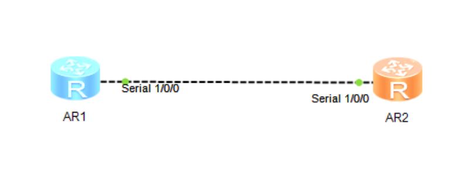
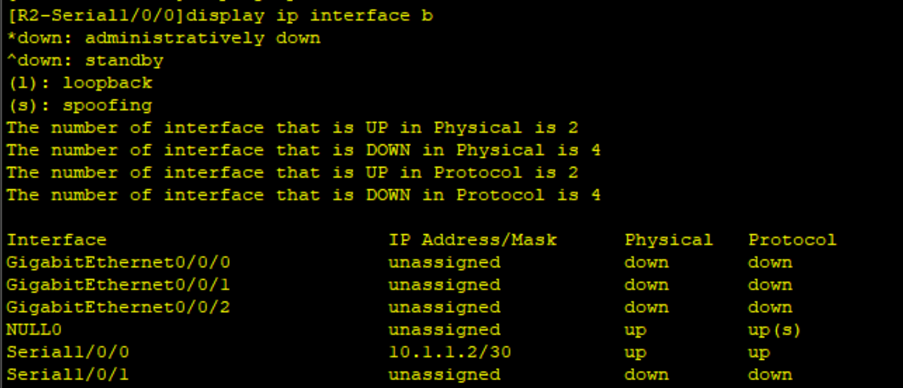

# 广域网

## ppp协议

### 网络拓扑图



```shell
R1
sys
undo in en
sys R1
int s1/0/0
[R1-Serial1/0/0]link-protocol ppp
q
[R1]aaa
[R1-aaa]local-user huawei password cipher huawei123
[R1-aaa]local-user huawei service-type ppp
int s1/0/0
[R1-Serial1/0/0]ppp authentication-mode pap
[R1-Serial1/0/0]ip add 10.1.1.1 30
```

```shell
R2
sys
undo in en
sys R2
int s1/0/0
[R2-Serial1/0/0]link-protocol ppp
[R2-Serial1/0/0]ppp pap local-user huawei password cipher huawei123
ip add 10.1.1.2 30
```

