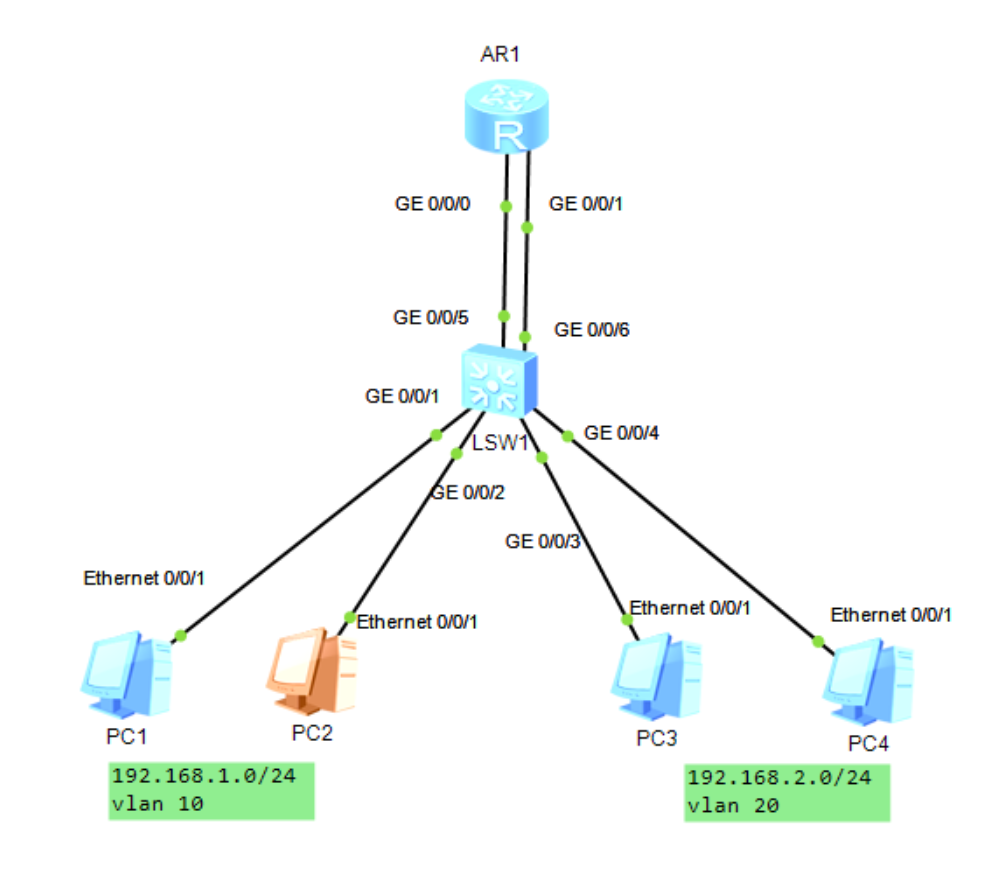
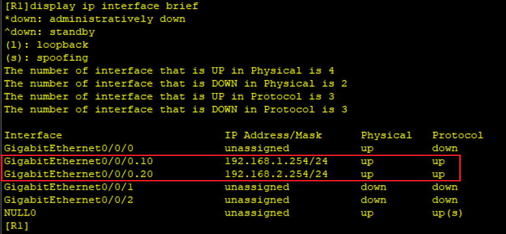

# 路由器互通vlan

## 直连路由

### 网络拓扑图



交换机配置

```shell
system-view
sysname SW1
undo in en
vlan batch 10 20

int g0/0/1
port link-type access
port default vlan 10

int g0/0/2
port link-type access
port default vlan 10

int g0/0/3
port link-type access
port default vlan 20

int g0/0/4
port link-type access
port default vlan 20

int g0/0/5
port link-type access
port default vlan 10

int g0/0/6
port link-type access
port default vlan 20
```

创建两个vlan，接口全部是access

### PC配置

PC1：192.168.1.1/24	网关254

PC2：192.168.1.2/24	网关254

PC3：192.168.2.1/24	网关254

PC4：192.168.2.2/24	网关254

### 路由器配置

简单配置接口ip就行

```shell
int g0/0/0
ip add 192.168.1.254 24
int g0/0/1
ip add 192.168.2.254 24
```

### 接口vlan配置


## 单臂路由（单线复用）

### 交换机配置

与路由器连接的接口改trunk

放行vlan 10 20

```shell
int g0/0/5
port link-type trunk
port trunk allow-pass vlan 10 20
```

### 路由器配置

先撤掉之前的接口ip

再配置子接口（子接口id与vlan无关，是自定义的）

子接口再绑定vid，这里才是绑定vlan

最后开启arp广播功能

```shell
int g0/0/0
undo ip add
int g0/0/1
undo ip add
int g0/0/0.10
ip add 192.168.1.254 24
dot1q termination vid 10
arp broadcast enable
int g0/0/0.20
ip add 192.168.2.254 24
dot1q termination vid 20
arp broadcast enable
```


