# 链路聚合

## 网络拓扑图

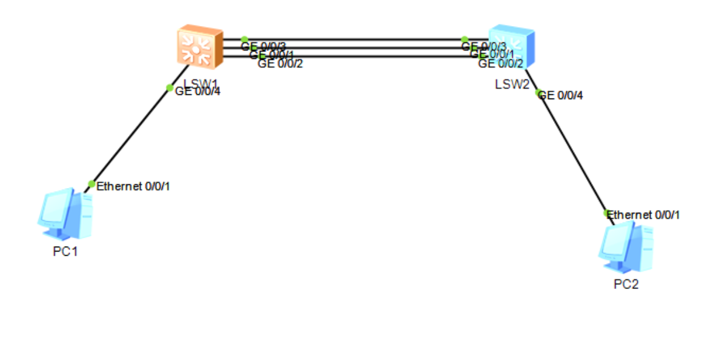

PC随便设一设

PC1

10.0.0.1/8

PC2

10.0.0.2/8

## 聚合前链路状态


由于stp的存在，当前只启用了g0/0/1这一个接口

相当于实际只有一条线

## 手动链路聚合

创建链路聚合组1号，编号随意，并把三个接口加入

```shell
SW1
sys
sysname SW1
undo in en
interface Eth-Trunk 1
q
int g0/0/1
eth-trunk 1
int g0/0/2
eth-trunk 1
int g0/0/3
eth-trunk 1
```

查看聚合组信息

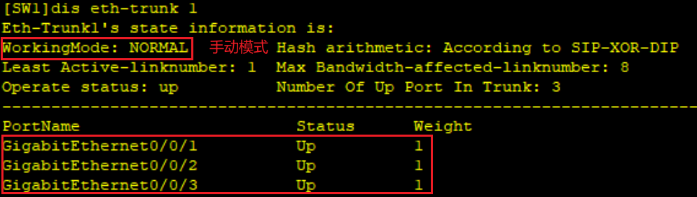

另一个交换机也是如此

其实有更方便的加接口命令

```shell
SW2
sys
sysname SW2
undo in en
interface Eth-Trunk 1
trunkport GigabitEthernet 0/0/1 to 0/0/3
```

此时查看stp

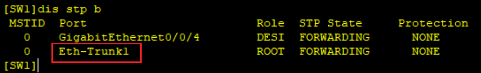

查看接口信息

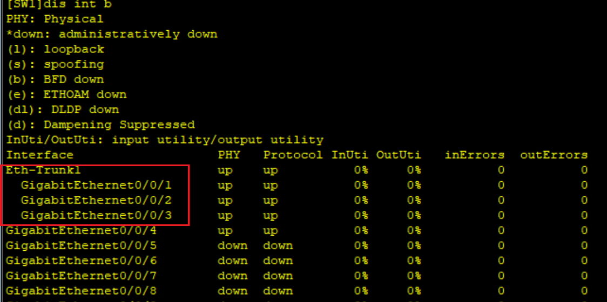

说明三条线路逻辑上聚合为Eth-Trunk 1了

PC之间可ping通

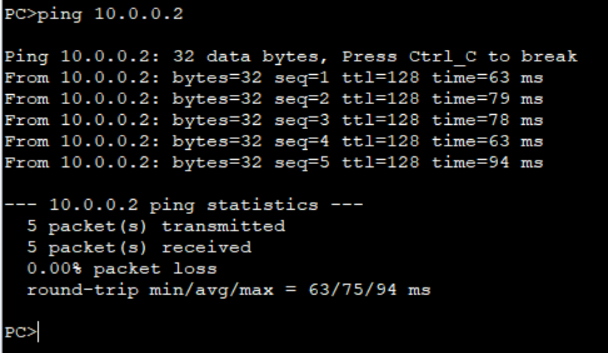

## LACP协议聚合

先把已经加入eth-trunk的接口清除，否则报错

进入聚合组1，改为LACP模式

再把接口加回来

```shell
SW1
int g0/0/1
undu eth-trunk
int g0/0/2
undu eth-trunk
int g0/0/3
undu eth-trunk
int eth 1
mode lacp-static
trunkport g 0/0/1 to 0/0/3
```

当前eth-trunk状态

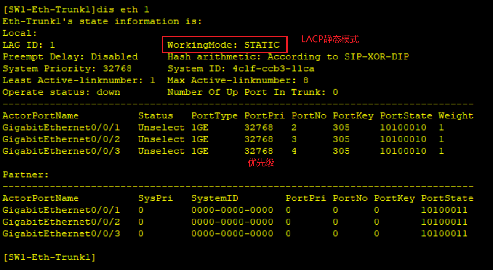

SW2同样

```shell
int eth 1
undo trunkport g 0/0/1 to 0/0/3
mode lacp-static
trunkport g 0/0/1 to 0/0/3
```

再查看聚合

之前没设置SW2时是不会启用聚合的

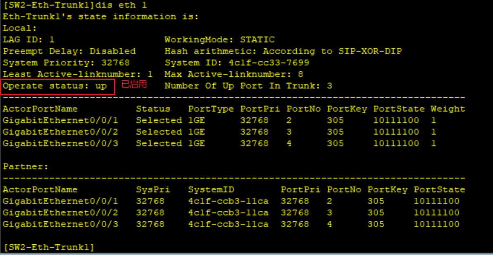

### 优先级设置

可以设置LACP优先级来确定LACP报文的收发关系

设置LACP优先级，默认32768，越小越优先

```shell
[SW1]lacp priority 100
```

修改最大活动链路数

```shell
[SW1]int eth 1
[SW1-Eth-Trunk1]max active-linknumber 2
```

最大活动链路修改为2

表示按照接口优先级/端口编号

两条链路用于聚合，一条备份

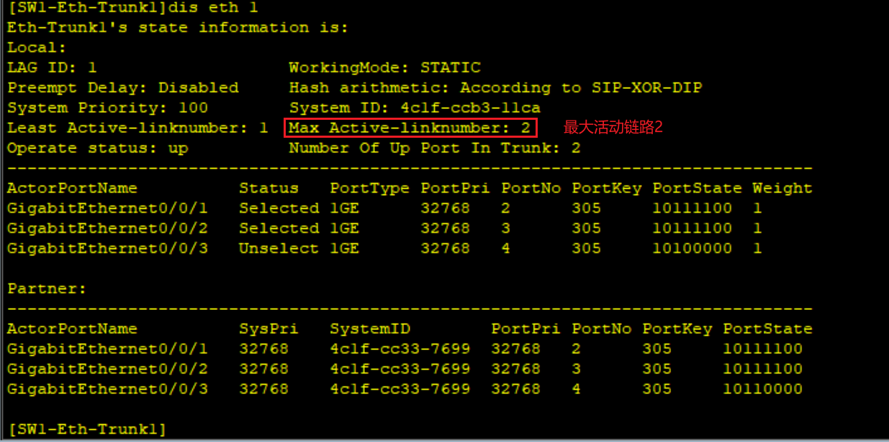

目前1、2口活动，3口备份

### 冗余测试

PC持续发包，关闭1口

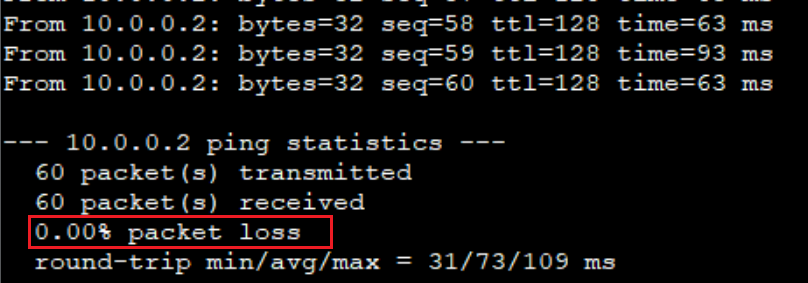

可见并没有丢包

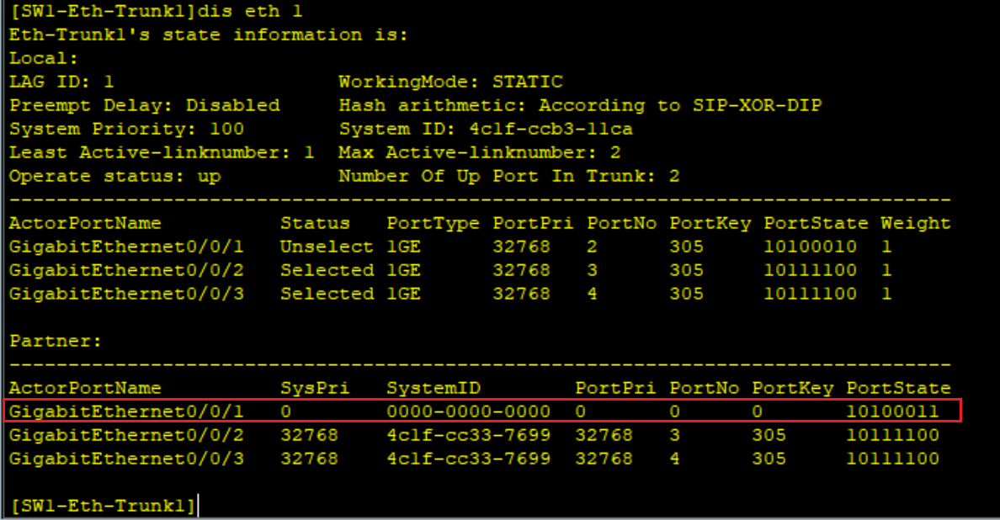

且SW2上的1口断开，3口开始接收

### 负载均衡模式

负载分担也是有不同模式的

默认的是基于源ip/目ip的模式

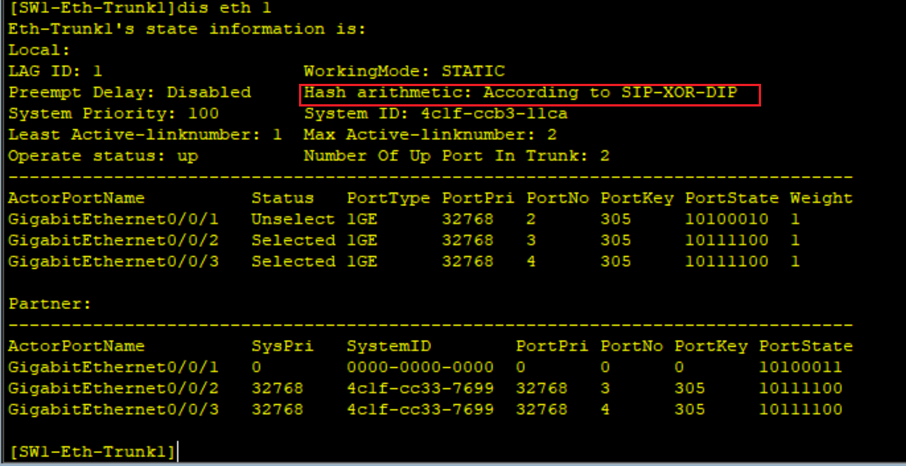

具体有以下模式

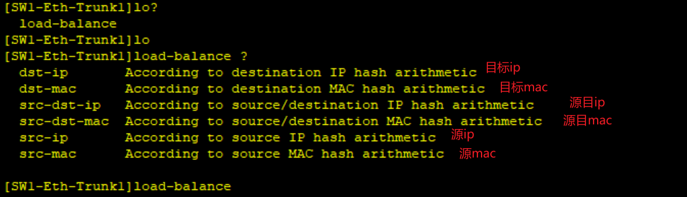

## 注意

将接口聚合后，在配置接口时应该配置聚合后的接口组

如配置接口类型为trunk

```shell
int eth 1
port link-type trunk
port trunk allow-pass vlan 10 20
```

